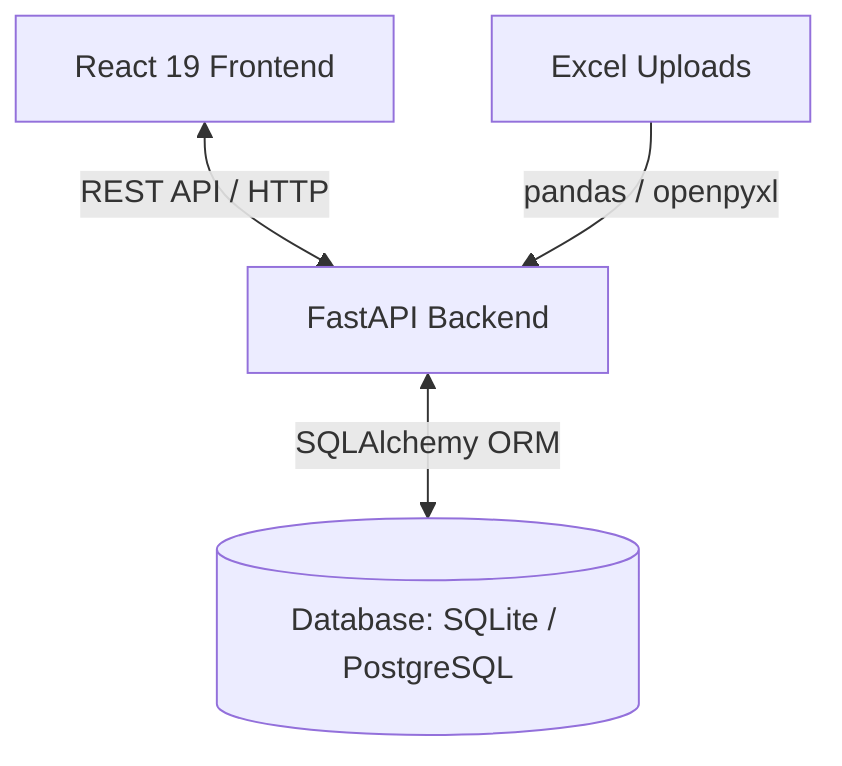

# Project Context

This document serves as the single source of truth for the **school-attendance-analytics** project structure, architecture, data flow, and development guidelines.

---

## 1. Project Identity

The core mission of **school-attendance-analytics** is to provide a robust, high-performance, and data-dense student attendance management and analytics dashboard. The application is designed to ingest attendance records from Excel sheets generated by physical scanning machines, normalize the data, reconcile student levels (Jenjang), handle manual administrative overrides (e.g., marking absences due to illness or permissions), and generate comprehensive reports for analysis.

Key functionalities:
* **Ingestion:** Secure bulk uploading and parsing of spreadsheet records.
* **Review & Override:** Authoritative correction logs that allow administrators to override scanner-marked absences.
* **Reporting:** Visualizations and data tables for tardiness, attendance summaries, and individual student profiles.

---

## 2. Architectural Blueprint

The application employs a decoupled client-server architecture connected via a REST API:

### Components
1. **Backend (FastAPI & Python 3.12):**
   * Located in [backend/](backend).
   * Exposes JSON endpoints using FastAPI routers. Run with Uvicorn.
   * Manages data access through SQLAlchemy ORM.
2. **Frontend (React 19 & JavaScript):**
   * Located in [frontend/](frontend).
   * Built with Vite configuration. Uses React Router v6.
   * Utilizes Chart.js for data-dense dashboards, Framer Motion for transitions, and Tailwind CSS 4 for styling.
3. **Database Environments:**
   * **Local Development:** SQLite database (`attendance.db`) running in WAL (Write-Ahead Logging) mode to prevent query concurrency locks.
   * **Docker / Production:** PostgreSQL 16 database.
4. **DevOps & Orchestration:**
   * **Docker Compose:** A supported secondary workflow defined in [docker-compose.yml](docker-compose.yml). It orchestrates the DB (`attendance_db` container), Backend, Frontend, and Nginx reverse proxy; direct Vite/FastAPI processes remain the primary local workflow.
   * **Dev Launcher:** Configured inside [start-dev.sh](start-dev.sh), starting Vite dev server (port 5173) and FastAPI (port 8000). Runs a proxy forwarding `/api/*` to the backend.

### Frontend Infrastructure & API Integration
* **TypeScript Transition:** The codebase is configured using `frontend/tsconfig.json` (replacing `jsconfig.json`) with minimal types `@types/react` and `@types/react-dom` to support strict type-based development on critical modules.
* **Routing & Navigation:** The Grade Ledger feature is bound to the `/grades` route in `frontend/src/App.js` and integrated directly into the `frontend/src/components/SidebarNav.jsx` navigation menu component.
* **Vite API Proxying:** The Vite development server runs an integrated proxy forwarding `/api/*` requests directly to `http://127.0.0.1:8000/api/...`. No double-prefix URL normalization or path stripping is required. All client requests are sent as canonical `/api/...` paths.

### Matrix-Based Grade Ledger UI (Phase 5 Implemented - Frontend Overhaul)
* **Dynamic Grid UI Engine:** The `frontend/src/components/grades/GradeMatrix.tsx` module provides a high-density (data-dense) spreadsheet-style interface. Rows display enrolled students, and columns map the `AssessmentComponent` dynamically based on the selected academic context.
* **Cell Control & State Management:** Each grid cell is managed as a controlled input component with strict constraints ($0.0 \le \text{score} \le 100.0$) and automatic coercion of empty strings to `null`. Locally modified data cells are highlighted in yellow (amber highlighting).
* **Batch Operation:** The UI module aggregates all modified data cells into a unified payload object of type `GradeGridSaveRequest` to be sent atomically via the main save button.
* **Page Lifecycle & Metadata Consumption:** The main `GradeLedger.tsx` page utilizes `AcademicYear[]` to determine the active academic year using the `is_default === true` flag. All legacy Excel import workflows and outdated analytical charts have been completely removed from the visual components.

### Executive Management Analytics Engine (Phases 10-17 Implemented)
* **Unified Analytics API:** The `backend/src/services/management_analytics.py` module provides a unified analytical engine that processes historical attendance records, grade matrix values, and active configurations efficiently:
  * `GET /api/analytics/filters` — Provides context-driven dropdown options (Academic Year, Jenjang, Class Name, Subject) populated dynamically from active database records.
  * `GET /api/analytics/management-summary` — Calculates monthly attendance percentages, tardiness minutes per class, separate Formatif/Sumatif academic averages (ignoring `null` grades), and Below-KKM alerts.
  * `GET /api/analytics/historical-trends` — Builds canonical historical trend series for attendance, lateness, academic performance, Below-KKM alerts, and interventions, with deterministic transparent forecasts and data sufficiency diagnostics.
  * `GET /api/analytics/intervention-impact` — Measures Academic Intervention effectiveness using captured intervention baseline averages against current Grade Ledger averages, with deterministic risk scoring and drilldown summaries by class, subject, owner, and student.
* **Management Report Export (Phase 11 & 15 & 16):**
  * `GET /api/analytics/management-summary/export/pdf` and `GET /api/analytics/management-summary/export/excel` generate report downloads powered by the same shared analytics computation.
  * PDF reports utilize ReportLab to construct a professional, searchable landscape document containing KPI cards, custom vector charts, Below-KKM listings, and Executive Insights.
  * Excel reports generate an advanced editable workbook using Pandas and XlsxWriter. Data cells are editable, and Excel-native charts update dynamically in real time.
  * Both export endpoints operate with zero disk footprint, building and writing data directly into in-memory `io.BytesIO` streams to support concurrent server environments safely.
* **Dynamic Academic Configuration (Phase 12 & 13):** The academic config endpoints under `/api/academic-config/...` manage database-backed configurations for KKM thresholds (`KkmThreshold`) and academic term mappings (`AcademicTermConfig`) without destructive schema migrations.
* **Academic Threshold Auditing:** Resolves effective KKM thresholds by specificity (academic year, jenjang, subject, assessment type) and alerts on students scoring below KKM. Falls back to a legacy target of `85.0` if no matching configuration is found.
* **Dynamic Term Resolution:** Matches term filter parameters to `AcademicTermConfig` date ranges, falling back to default monthly academic calendar ranges (July-Sept, Oct-Dec, Jan-Mar, Apr-Jun) when no override is stored.
* **Academic Intervention Workflow (Phase 14):** Keeps track of actionable intervention rows (`AcademicIntervention`) created from Below-KKM alerts under `/api/academic-interventions/...`. Active duplicate prevention blocks duplicate active entries for the same context.
* **Executive Insights Engine (Phase 16):** Performs rule-based check functions evaluating dashboard thresholds (attendance targets, lateness concentration, Sumatif-Formatif score gaps, overdue interventions) to generate high-value Analisis & Rekomendasi Manajemen summaries printed on the JSON dashboard, frontend dashboard panel, PDF page 1, and Excel `Insights` worksheet.
* **Data-Dense Performance Visualization:** The frontend module `frontend/src/pages/ManagementAnalytics.tsx` renders data-dense visualizations using Chart.js, Lucide icons, and Tailwind CSS 4 utility classes directly bound to the main sidebar layout.
* **Parity QA Framework (Phase 17):** Implements a comprehensive golden fixture dataset and report parity tests inside [test_report_parity.py](backend/tests/test_report_parity.py). The test suite guarantees numerical accuracy (attendance rates, lateness durations, null score exclusion) and structural formatting consistency between JSON dashboard endpoints, ReportLab PDF generation, and Excel worksheets.
* **Historical Trend Analytics & Transparent Forecasting (Phase 18):** Adds [analytics_trends.py](backend/src/services/analytics_trends.py) and [analytics_forecast.py](backend/src/services/analytics_forecast.py) for rule-based historical analytics. Forecasts use moving average, weighted moving average, or simple linear trend only; they expose method, history point count, confidence, and sufficiency warnings. Management Analytics renders a Historical Trends section, PDF exports include trend/forecast pages, and editable Excel exports include trend/forecast sheets with native linked charts.
* **Intervention Impact Analysis & Drilldown Analytics (Phase 19):** Adds [intervention_impact.py](backend/src/services/intervention_impact.py) for deterministic intervention impact rows, summary metrics, risk scoring, owner workload, student risk lists, and `intervention_impact` Executive Insights. Management Analytics renders an Intervention Impact section, PDF exports include an impact page, and editable Excel exports include impact source sheets with native linked charts.

---

## 3. Database & Integrity Strategy

### ORM Schema Map
The database contains the following models, configured inside [backend/src/models/](backend/src/models):
* **[Student](backend/src/models/student.py):** Represents student masters. Includes a unique constraint on `name` (`_student_name_uc`).
* **[Attendance](backend/src/models/attendance.py):** Main scan/attendance record. Constrained by a composite unique index `_student_date_uc` on `(student_id, date)`.
* **[AttendanceOverride](backend/src/models/attendance_review.py):** Active administrative corrections mapping an original status to the new overridden value (e.g. overriding `absent` -> `sakit`).
* **[AttendanceOverrideHistory](backend/src/models/attendance_review.py):** Append-only audit logs capturing history changes.
* **[UploadLog](backend/src/models/upload_log.py):** Record of historical spreadsheet imports.
* **[AbsenceReason](backend/src/models/absence_reason.py) & [AbsenceReasonClassEntry](backend/src/models/absence_reason_class_entry.py):** Mapping detailed reasons to specific classes.
* **[JenjangConfig](backend/src/models/jenjang_config.py):** Configures late cut-off schedules.
* **[HebOverride](backend/src/models/heb_override.py):** Calendar entries defining non-effective school days (Hari Efektif Bersama).
* **[KkmThreshold](backend/src/models/academic_config.py):** Database-backed academic thresholds by academic year, optional jenjang, optional subject, and assessment type.
* **[AcademicTermConfig](backend/src/models/academic_config.py):** Custom Term 1-4 date ranges by academic year.
* **[AcademicIntervention](backend/src/models/academic_intervention.py):** Auditable academic follow-up rows created from Below-KKM alerts or manual intervention payloads. Active duplicate prevention is enforced in the API for the same student, academic year, subject, assessment type, and term context while status is `open`, `in_progress`, or `monitoring`.

### Migration Discipline
Database migrations are kept under [backend/migrations/](backend/migrations) as date-stamped `.sql` files. Instead of using Alembic:
* System startup (`init_db()` in [backend/src/core/database.py](backend/src/core/database.py)) runs `Base.metadata.create_all` to declare new structures.
* Self-healing programmatic statements run `ALTER TABLE` or `CREATE INDEX IF NOT EXISTS` commands to patch local SQLite databases when schemas update.

### Dynamic Grade Ledger Ecosystem (Phase 4 Implemented - Backend Migration)
* **Normalized Data Model:** The system has transitioned fully from time-based columns (terms) to a dynamic, jenjang-aware matrix structure using six core entities: `AcademicYear`, `Jenjang` (decoupled from `JenjangConfig`), `Subject`, `AssessmentComponent`, `StudentEnrollment`, and `StudentSubjectGrade`.
* **Cascade & Audit Rules:** Deletion operations are strictly configured: deleting a student entity triggers a cascade to `student_enrollments` and `student_subject_grades`. However, deleting master data (`AcademicYear`, `Jenjang`, `Subject`, `AssessmentComponent`) is protected by `ON DELETE RESTRICT` rules to maintain the integrity of historical academic grades.
* **Database Bootstrapping & Legacy Safety:** The `backend/src/core/database.py` module executes a safe initialization:
  * Renaming the old `student_term_grades` table to `student_term_grades_legacy` without deleting historical data.
  * Triggering the `run_grade_ledger_patches(engine)` function to inject system default components if empty (sumatif quiz, sumatif test, sumatif total, formatif total).
  * Applying a multi-dialect (PostgreSQL & SQLite) partial unique index on `AcademicYear` to restrict to only one default academic year (`is_default = True`).
* **API Structure:** The `backend/src/api/grades.py` module exposes `POST /api/grades/save` which accepts a Pydantic v2 validation schema `GradeGridSaveRequest` containing `enrollment_id` and an inline array of scores ($0.0 \le \text{score} \le 100.0$ or `null`). The legacy Excel import endpoint has been completely removed.
* **Master Data Read Endpoints (Phase 6 Implemented):** The backend router provides structured master data read routes with stable ordering for frontend grid consumption:
  * `GET /api/grades/academic-years` — Returns all academic years ordered by `start_date` and `id`.
  * `GET /api/grades/subjects?jenjang_id={id}` — Returns subjects filtered by the mandatory jenjang ID parameter, ordered by `name`.
  * `GET /api/grades/components` — Returns all assessment components (global & subject-scoped) ordered by `name`.

### Student Enrollment Registry (Phase 8 Implemented - Enrollment Bridge)
* **Enrollment Ingestion Flow:** Student data mapping is split into two isolated phases: the `/mapping` page manages the physical existence of students in the master `students` table, while the `/enrollment` page acts as a periodic allocation pipeline to the `student_enrollments` table.
* **Conflict Prevention Strategy:** The candidate queue filtering pipeline automatically excludes students from the queue if they are already enrolled in the same active academic year, regardless of level selections, to prevent violating the Unique Constraint `_student_year_uc`.
* **API Extension Array:** The backend router ecosystem is extended with five new transactional endpoints:
  * `GET /api/grades/jenjangs` — Fetches the list of master jenjangs.
  * `GET /api/grades/enrollment/candidates` — Fetches the queue of master students who are not yet enrolled in the active academic year.
  * `GET /api/grades/enrollment` — Fetches active enrolled student data based on selected filters.
  * `POST /api/grades/enrollment/bulk` — Performs bulk enrollment of new students atomically and safely from duplicates.
  * `DELETE /api/grades/enrollment/{id}` — Deletes a student enrollment row without deleting the student's master record from the database.

### Unified Academic & Enrollment Management (Phase 9 Implemented)
* **Unified Control Hub:** The `/academic-management` page acts as a control center for setting up master data with an isolated tab-based architecture: *Calendar & Subjects*, *Class Allocation*, and *KKM & Term Settings*.
* **Dynamic Content Creation:** Provides new mutation modules to register academic calendars and jenjang-bound subjects securely via the following endpoints:
  * `POST /api/grades/academic-years` — Adds a new academic year. The backend logic automatically unsets the `is_default` flag of the old default academic year before setting the new entity as default to maintain database partial index validity.
  * `POST /api/grades/subjects` — Dynamically adds a new subject bound to a master `jenjang_id`.
* **Component Optimization & Component Reuse:** Student allocation logic is extracted into a modular component `frontend/src/components/enrollment/EnrollmentPanel.tsx`. This component is shared between the `/enrollment` page and the class allocation tab to maintain UI state consistency.
* **Mitigation of Denormalization Drift:** The allocation panel explicitly enforces that `/mapping` retains sole authority as the *master student identity pool*. Class allocation to the `student_enrollments` table is purely temporal-akademik (temporal-academic) and does not compromise the physical student identity records.
* **Academic Configuration Controls (Phase 12):** The `frontend/src/components/academic/AcademicConfigPanel.tsx` panel lets admins create, edit, delete, and restore KKM/term configuration. These operations are scoped to `kkm_thresholds` and `academic_term_configs` only and do not modify upload logs, attendance rows, students, enrollments, or grades.
* **Executive Report Builder (Phase 20):** The `/academic-management` page now includes a `Report Builder` tab for reusable report templates, branding, section ordering, and preview/export presets. The canonical API lives under `/api/report-builder/...`, default templates and branding are seeded idempotently on startup, and user-customized templates are not overwritten by startup seeding.

### Audit & Append-Only Triggers
To enforce absolute traceability:
* Database triggers are configured on `attendance_override_history`.
* Trigger `trg_history_no_update` and `trg_history_no_delete` throw abort exceptions when any attempt is made to edit or delete existing override logs.
* SQLite: Implemented using `RAISE(ABORT, ...)` triggers inside `_AUDIT_TRIGGERS_SQL` in [backend/src/api/system.py](backend/src/api/system.py).
* PostgreSQL: Trigger function calling `RAISE EXCEPTION` for update/delete queries.

### Guarded Resets & Data Clearing
* The system endpoint `POST /system/clear-data` inside [backend/src/api/system.py](backend/src/api/system.py) allows three clear modes: `attendance`, `attendance_keep_exceptions`, or `full`.
* The operation is guarded by checking the environment variable `ENABLE_DESTRUCTIVE_OPERATIONS` which must be explicitly `True`.
* Executing the command requires passing the confirmation token `"CLEAR_ALL_ATTENDANCE_DATA"`.
* When clearing data, audit triggers are dropped temporarily to allow purging, then immediately recreated before committing the transaction.

---

## 4. Excel Import Pipeline

The ingestion pipeline converts raw excel columns into structured SQLite/PostgreSQL rows. The flow is defined inside [backend/src/services/excel_parser.py](backend/src/services/excel_parser.py):

| Excel Raw Column | System Property | Constraints & Null-Handling |
| :--- | :--- | :--- |
| `No. ID` | `Student.id` / `Attendance.student_id` | Must map to an integer. |
| `Nama` | `Student.name` | Auto-registers new students if name does not exist. |
| `Tanggal` | `Attendance.date` | Format: `DD/MM/YYYY`. Invalid formats drop row. |
| `Scan Masuk` | `Attendance.check_in` | Coerced to time; invalid values register warning. |
| `Scan Pulang` | `Attendance.check_out` | Coerced to time; invalid values register warning. |
| `Terlambat` | `Attendance.late_duration` | Interpreted as minutes. Used to derive lateness status. |

### Ingestion & Processing Details
1. **Chunk Processing:** The excel file is read in chunks of `1000` rows using `pandas` and `openpyxl`.
2. **Upsert Logic:** Attendance data uses SQL upsert query patterns or merges on the composite index `_student_date_uc` (Student ID + Date) to prevent duplicate records.
3. **Status Derivation:**
   * Standard status: derived as `on-time` or `late` (if tardy minutes exist), `incomplete` (only one scan recorded), or `absent` (both scans empty).
   * Overridden status: overrides are preserved and *never overwritten* by subsequent spreadsheet imports unless specified.
4. **Smart Clears:** The `attendance_keep_exceptions` mode allows data re-uploads by wiping out standard records (`on-time`, `late`, `incomplete`) while retaining custom exception overrides (`sakit`, `izin`, `alfa`).

---

## 5. Styling Guardrails

The visual aesthetic of the project uses Tailwind CSS 4 utility classes for a clean, data-dense administrative UI.

### Theme & Layout Guidelines
* **Standard ClassNames:** All React page components must declare design details using Tailwind utility strings inside the `className` attribute.
* **No Inline Styles:** Except for elements requiring dynamic browser rendering constraints (e.g. Chart.js `<canvas>` height/width parameters), inline style attributes are strictly forbidden.
* **Semantic Status Indicators:** To maintain administrative readability, the application maps attendance statuses to specific color rules:

| Attendance Status | Color Class | Status Context |
| :--- | :--- | :--- |
| **Hadir / On-Time** | `emerald` (Green) | Present on time. |
| **Terlambat / Late** | `orange` (Orange) | Check-in occurs after school cutoff. |
| **Sakit** | `blue` (Blue) | Excused absence due to illness. |
| **Izin** | `amber` (Amber) | Excused absence with permission. |
| **Alfa** | `rose` / `red` (Red) | Unexcused absence. |

* **Interactive Polish:** Buttons, cards, and modal components should incorporate Framer Motion triggers, smooth focus ring transitions, and `isLoading` loading animations to preserve user accessibility.

---

## API Route Convention

Backend public application APIs are exposed under `/api/<domain>/...`.

Canonical examples:

- `/api/grades/academic-years`
- `/api/grades/save`
- `/api/analytics/filters`
- `/api/analytics/management-summary`
- `/api/analytics/historical-trends`
- `/api/analytics/intervention-impact`
- `/api/analytics/management-summary/export/pdf`
- `/api/analytics/management-summary/export/excel`
- `/api/academic-config/kkm-thresholds`
- `/api/academic-config/kkm-effective`
- `/api/academic-config/terms`
- `/api/academic-config/terms/effective`
- `/api/academic-interventions`
- `/api/academic-interventions/{id}`

Frontend wrappers call APIs through `apiRequest` using these exact canonical paths. In local development, the Vite dev proxy forwards these to the backend transparently.

Management Analytics currently also preserves `/analytics/...` as a legacy compatibility alias. New code should not use that alias.
