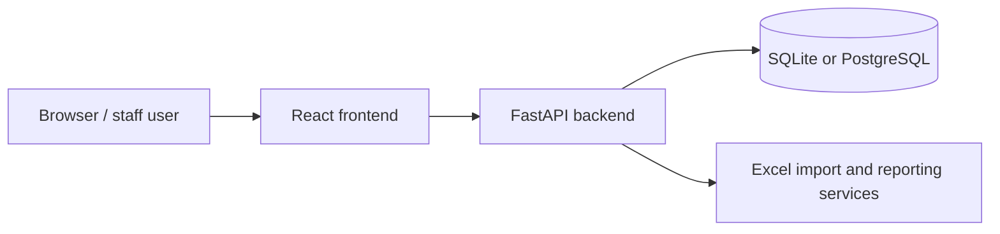
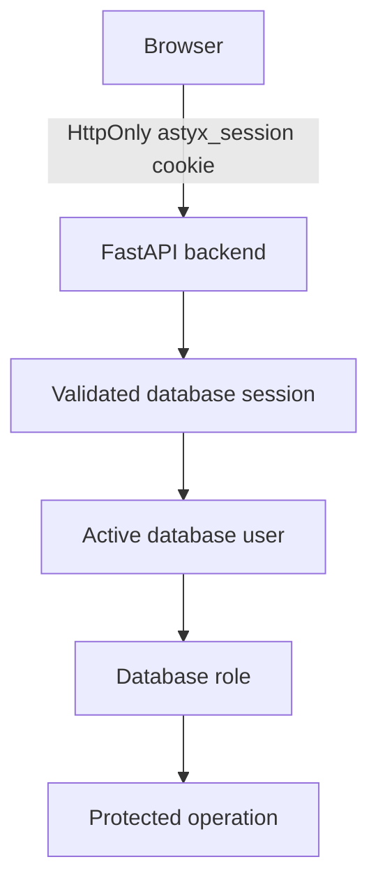
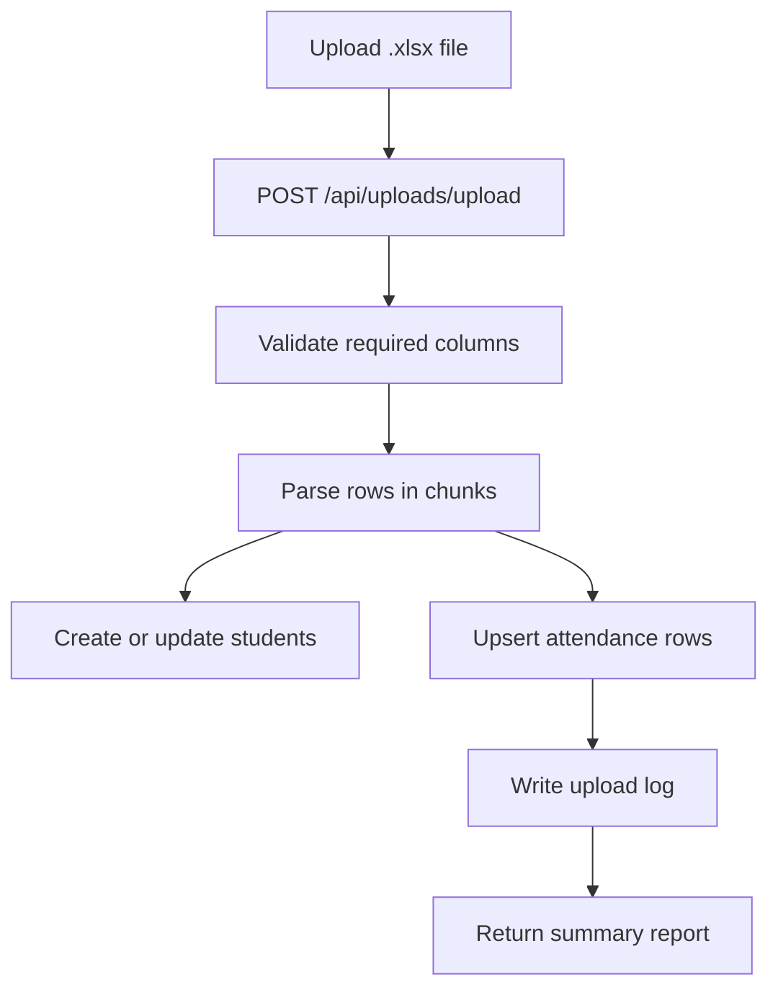

# OperatorOS

Current completed milestone: **Phase 10 — Incremental Design-System Modernization**. See the [Phase 10 release notes](docs/releases/phase-10-design-system-modernization.md), [design-system review](docs/phase10-design-system-review.md), and [current roadmap](docs/project-status/current-roadmap.md).

The prior **`v0.9.0-platform-foundation`** inventory, security review, and release notes remain the historical Phase 9 baseline. Phase 9.6 still requires the documented clean-Windows external acceptance run before the platform foundation is fully closed.

OperatorOS is an offline-first full-stack system for importing school attendance spreadsheets, reviewing and correcting attendance data, configuring lateness rules, and generating operational and executive reports.

## What It Does
- Imports `.xlsx` attendance exports into a backend database.
- Tracks students, class mappings, HEB calculations, absence reasons, upload history, and attendance overrides.
- Generates dashboard, attendance, rekap absensi, and tardiness reports.
- Provides Management Analytics with PDF/Excel export for attendance, lateness, grade, and Below-KKM review.
- Supports database-backed KKM thresholds and custom academic term date ranges.
- Tracks academic interventions created from Below-KKM alerts.
- Runs locally with SQLite or PostgreSQL and also through Docker Compose.

## Architecture


## Security Architecture

OperatorOS uses a layered local security model:

1. backup integrity protection;
2. guarded restore with safety snapshot and rollback;
3. database-backed user identity and server-side sessions;
4. role-based backend authorization; and
5. authentication, authorization-denial, and restore lifecycle audit logging.



Only the backend grants access. Frontend identity and role state are navigation conveniences. Client fields such as `request.role`, `reviewed_by`, `entered_by`, and `uploaded_by` are untrusted metadata, not authorization evidence. See [Identity and Authentication](docs/security/identity-authentication.md) and [Backup and Restore Security](docs/security/backup-restore.md).

## Stack
- Backend: Python 3.12, FastAPI, SQLAlchemy, Pydantic, Uvicorn, pandas, openpyxl
- Frontend: React 19, Vite, React Router, Tailwind CSS 4, Chart.js, Framer Motion, lucide-react
- Database: SQLite for local files, PostgreSQL 16 in `docker-compose.yml`
- Infrastructure: Docker, Docker Compose, Nginx, Agent Browser, WSL2-friendly shell scripts

## Repository Layout
- [`backend/`](backend/): API routers, settings, ORM models, services, and raw SQL migrations
- [`frontend/`](frontend/): React pages, shared components, API client, and Nginx config
- [`docs/`](docs/): WSL2 guidance, utility script notes, and operational references
- [`scratch/`](scratch/): one-off diagnostics and experiments
- Top-level `*.py`: reporting or repair utilities; several rewrite code or output files
- [`start-dev.sh`](start-dev.sh): combined dev launcher starting Vite frontend and FastAPI backend
- [`scripts/verify-browser.sh`](scripts/verify-browser.sh): Agent Browser smoke test

## Prerequisites
- Python 3.12
- Node.js 20+
- npm
- Agent Browser on the PATH if you want browser verification
- Docker and Docker Compose for containerized development

## Quick Start
Direct Node.js/Vite and Python/FastAPI processes are the primary local-development workflow. Docker Compose is a supported secondary workflow for containerized deployment, PostgreSQL provisioning, Nginx routing, and operational verification.

### Local Development Launcher
```bash
./start-dev.sh
```

The launcher validates Node.js, npm, locked frontend dependencies, the Python environment, backend imports, and ports before starting anything. It displays the ready banner only after both health checks pass and stores service logs under `.dev-logs/`. Press `Ctrl+C` to stop both process groups cleanly.

On a fresh database, open the frontend and create the first administrator on the setup screen. OperatorOS then closes setup permanently and redirects to normal login. There are no default credentials.

For a trusted headless/local shell, use the same provisioning service interactively:

```bash
cd backend
PYTHONPATH=src .venv/bin/python -m cli create-admin
```

Passwords are read with hidden terminal input and are never accepted as command-line arguments.

Run diagnostics without starting services:

```bash
./start-dev.sh --check
```

Initial dependency setup remains explicit:

```bash
cd backend
python3.12 -m venv .venv
source .venv/bin/activate
pip install -r requirements.txt
cd ../frontend
npm ci
```

### Browser smoke test
```bash
./scripts/verify-browser.sh
```

This launches the app and then runs [`scripts/verify-browser.sh`](scripts/verify-browser.sh) against the live frontend URL (`http://127.0.0.1:5173`).

## Local Development Without start-dev.sh
```bash
cd backend
python3.12 -m venv .venv
source .venv/bin/activate
pip install -r requirements.txt
uvicorn src.main:app --reload --host 127.0.0.1 --port 8000
```

```bash
cd frontend
npm install
npm run dev
```

Open:
- Frontend: `http://127.0.0.1:5173`
- Backend API: `http://127.0.0.1:8000`
- OpenAPI docs: `http://127.0.0.1:8000/docs`
- Redoc: `http://127.0.0.1:8000/redoc`

## Docker Compose
```bash
cp .env.example .env
# Set POSTGRES_PASSWORD, AUTH_COOKIE_SECRET, and ASTRYX_SETUP_TOKEN as instructed in .env.
docker compose config
docker compose up --build
```

Compose starts:
- Backend on `http://localhost:8000`
- Frontend on `http://localhost`
- PostgreSQL on the internal `db` service

Compose fails before startup unless `.env` supplies `POSTGRES_PASSWORD`, a persistent `AUTH_COOKIE_SECRET` of at least 32 characters, and a high-entropy `ASTRYX_SETUP_TOKEN`. Generate each application secret independently with `python -c "import secrets; print(secrets.token_urlsafe(48))"`; never commit or log the resulting values. The setup token is required only by the one-time web bootstrap and should be removed from deployed secrets after the first administrator is created.

The containerized frontend bundle uses `/api` as its browser API base. Nginx proxies `/api/` requests to the backend container.

Fresh PostgreSQL volumes apply the identity, backup-scheduler, and first-admin setup migrations through read-only initialization scripts before the database reports ready. Existing volumes are never re-migrated automatically; follow [`backend/migrations/README.md`](backend/migrations/README.md) and take a verified backup before applying a new forward migration. PostgreSQL data persists in `db_data`; application backup and audit artifacts persist in `backend_data` at `/app/data/backups`.

## Environment Variables

For `./start-dev.sh`, absent database and authentication settings are supplied by launcher-owned files under the gitignored `backend/.local-dev/` directory. The launcher uses an absolute SQLite URL, creates one persistent local authentication secret, and applies the approved SQLite identity migration only when creating its own fresh disposable database. Explicit `DATABASE_URL`, `POSTGRES_*`, and `AUTH_COOKIE_SECRET` values always take precedence.

| Variable | Service | Required | Default | Description | Example |
| --- | --- | ---: | --- | --- | --- |
| `DATABASE_URL` | Backend | No | unset | SQLite or external PostgreSQL URL used when `POSTGRES_*` is not provided. | `sqlite:///./attendance.db` |
| `POSTGRES_USER` | Backend / Compose | No | `postgres` | PostgreSQL user for the Compose database service. | `postgres` |
| `POSTGRES_PASSWORD` | Backend / Compose | Yes for Compose | unset | PostgreSQL password supplied through the gitignored `.env`; Compose refuses to start when absent. | *(secret value)* |
| `POSTGRES_DB` | Backend / Compose | No | `absensi` | PostgreSQL database name for Compose. | `absensi` |
| `POSTGRES_HOST` | Backend / Compose | No | `db` | Compose hostname for the PostgreSQL service. | `db` |
| `POSTGRES_PORT` | Backend / Compose | No | `5432` | PostgreSQL port used by the backend container. | `5432` |
| `ENABLE_DESTRUCTIVE_OPERATIONS` | Backend | No | `false` | Enables guarded reset actions such as `POST /api/system/clear-data`. | `true` |
| `AUTH_COOKIE_SECRET` | Backend | Yes | unset | Persistent secret used to derive server-side session token digests. Must contain at least 32 characters; store only in protected backend configuration and share across workers. | *(secret value)* |
| `ASTRYX_SETUP_TOKEN` | Setup API / Compose | Required by Compose | unset | High-entropy external token protecting first-run web provisioning. Direct loopback setup and the trusted interactive CLI may omit it. | *(secret value)* |
| `COOKIE_SECURE` | Backend | No | `false` | Sets the authentication cookie Secure attribute; use `false` for localhost HTTP and `true` for HTTPS. | `true` |
| `SESSION_IDLE_TIMEOUT_HOURS` | Backend | No | `6` | Idle session lifetime for the offline deployment profile. | `6` |
| `SESSION_ABSOLUTE_TIMEOUT_HOURS` | Backend | No | `24` | Absolute session lifetime. | `24` |
| `MAX_FAILED_LOGIN_ATTEMPTS` | Backend | No | `5` | Consecutive failed logins allowed before account lock. | `5` |
| `ACCOUNT_LOCK_MINUTES` | Backend | No | `30` | Account lock duration after the failed-login threshold. | `30` |
| `BACKEND_WORKERS` | Backend | No | `1` | Declares the backend worker count used by scheduler and restore safety checks. Compose intentionally uses one worker. | `1` |
| `RESTORE_SINGLE_WORKER_REQUIRED` | Backend | No | `true` | Rejects restore unless `BACKEND_WORKERS=1`; keep enabled until approved cross-process locking exists. | `true` |
| `ALLOWED_ORIGINS` | Backend | No | `http://localhost:3000,http://127.0.0.1:3000,http://localhost:5173,http://127.0.0.1:5173` | Comma-separated CORS origins for development. | `http://localhost:5173,http://127.0.0.1:5173` |
| `HOST` | Backend | No | `0.0.0.0` | Bind host used by the backend runtime. | `0.0.0.0` |
| `PORT` | Backend | No | `8000` | Bind port used by the backend runtime. | `8000` |
| `VITE_API_BASE_URL` | Frontend | No | unset | Build-time API base URL used by the Vite client. If empty, uses same-origin with Vite proxy. | `http://localhost:8000` |

## Database and Migrations
- Database restore requires an authenticated administrator, an identity-compatible backup with an active administrator, exact confirmation, and single-worker runtime. Successful restore revokes every restored session and requires all operators to sign in again. Multi-worker deployments fail closed because the repository has no approved cross-process restore lock.
- The backend creates tables on startup with SQLAlchemy metadata.
- SQLite connections enable foreign keys, WAL mode, and related pragmas in `backend/src/core/database.py`.
- Historical schema changes live in `backend/migrations/` as raw SQL for SQLite and PostgreSQL.
- When PostgreSQL fields are set, the backend builds a SQLAlchemy URL from the separate connection parts instead of string-concatenating credentials.

## Management Analytics and Academic Config
- Management Analytics is available at `/analytics`.
- Dashboard data comes from `GET /api/analytics/management-summary`.
- Filtered management reports can be downloaded from:
  - `GET /api/analytics/management-summary/export/pdf`
  - `GET /api/analytics/management-summary/export/excel`
- KKM thresholds and term date ranges are configured in `/academic-management` under `KKM & Term Settings`.
- Academic config APIs are canonical under `/api/academic-config/...`.
- Academic interventions can be created and updated from Below-KKM alerts in Management Analytics.
- Intervention APIs are canonical under `/api/academic-interventions/...`.
- If no custom KKM threshold applies, analytics preserves the legacy fallback threshold `85.0`.
- If no custom term range exists, analytics preserves the default Term 1-4 date mapping.

## Excel Import Workflow


- The import expects the first worksheet to contain the required attendance columns.
- Only `.xlsx` files are accepted by the upload endpoint.
- A sample template is available at `GET /api/uploads/sample-template`.

## Surface URLs
| Surface | Local development | Docker |
| --- | --- | --- |
| Frontend | `http://127.0.0.1:5173` | `http://localhost` |
| Backend API | `http://127.0.0.1:8000` | `http://localhost:8000` |
| OpenAPI docs | `http://127.0.0.1:8000/docs` | `http://localhost:8000/docs` |
| Redoc | `http://127.0.0.1:8000/redoc` | `http://localhost:8000/redoc` |

## Validation and Testing
- Backend smoke check: `cd backend && python3 -c "from src.main import app; assert app is not None"`
- Backend tests: `cd backend && pytest`
- Frontend build: `cd frontend && npm run build`
- Browser smoke: `./scripts/verify-browser.sh`
- Compose config validation: `docker compose config`

## Troubleshooting
- If the Vite dev server fails, verify `frontend/node_modules/` exists. Run `cd frontend && npm install` if needed.
- If uploads fail, confirm the workbook is `.xlsx` and that the required columns exist on the first sheet.
- If WSL2 file watching is unreliable, keep the repo on the Linux filesystem rather than `/mnt/c`.

## Security and Data Handling
- OperatorOS uses database-backed users, revocable server-side sessions, an HttpOnly cookie, and Argon2id password hashes.
- Backend roles are `admin` and `staff`; client-provided roles never authorize a request.
- `POST /api/system/clear-data` is disabled by default and requires an authenticated administrator plus exact confirmation when enabled.
- Backup restore additionally requires identity-compatible data, an active administrator, single-worker runtime, and mandatory reauthentication after success.
- Treat imported spreadsheets, SQLite databases, browser artifacts, and generated Excel outputs as sensitive operational data.
- Keep development PostgreSQL credentials out of real deployments.

Implemented security does not include MFA, SSO, OAuth, LDAP, password-reset email, cloud identity, encrypted backups, distributed restore locking, or a granular permission matrix. There is currently no supported user-administration UI or CLI.

## Contribution Workflow
1. Read the relevant app and docs files first.
2. Make the smallest safe change.
3. Update or add tests when behavior changes.
4. Run the most relevant verification command.
5. For user-visible frontend changes, run the browser smoke test when Agent Browser is available.
6. Document any data migrations or operational caveats in the PR.

## Further Reading
- [Backend guide](backend/README.md)
- [Frontend guide](frontend/README.md)
- [WSL2 / DevOps guide](docs/WSL2_DEVOPS.md)
- [Utility scripts](docs/UTILITY_SCRIPTS.md)
- [Identity and authentication](docs/security/identity-authentication.md)
- [Backup and restore security](docs/security/backup-restore.md)
- [User administration status](docs/security/user-administration.md)
- [Agent instructions](AGENTS.md)
