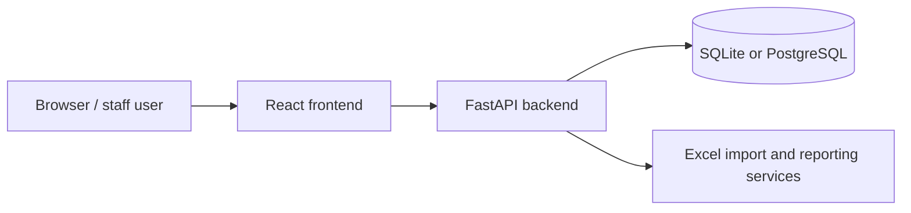
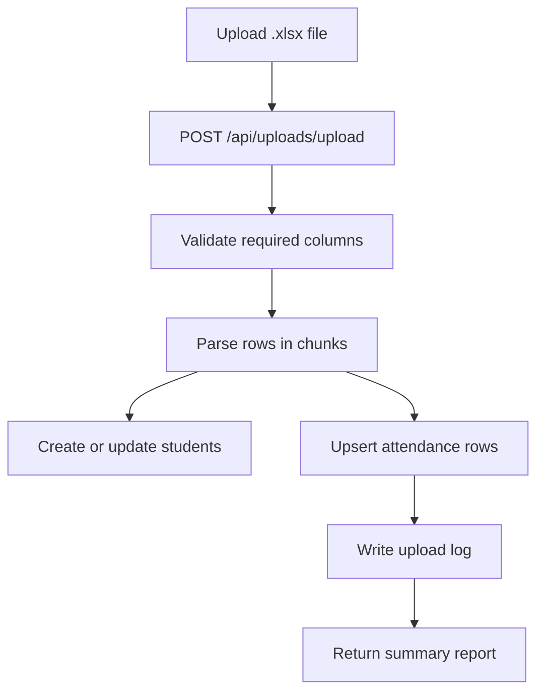

# School Attendance Analytics

School Attendance Analytics is a full-stack system for importing school attendance spreadsheets, reviewing and correcting attendance data, configuring lateness rules, and generating operational and executive reports.

## What It Does
- Imports `.xlsx` attendance exports into a backend database.
- Tracks students, class mappings, HEB calculations, absence reasons, upload history, and attendance overrides.
- Generates dashboard, attendance, rekap absensi, and tardiness reports.
- Provides Management Analytics with PDF/Excel export for attendance, lateness, grade, and Below-KKM review.
- Supports database-backed KKM thresholds and custom academic term date ranges.
- Tracks academic interventions created from Below-KKM alerts.
- Runs locally with SQLite or PostgreSQL and also through Docker Compose.

## Architecture


## Stack
- Backend: Python 3.12, FastAPI, SQLAlchemy, Pydantic, Uvicorn, pandas, openpyxl
- Frontend: React 19, Vite, React Router, Tailwind CSS 4, Chart.js, Framer Motion, lucide-react
- Database: SQLite for local files, PostgreSQL 16 in `docker-compose.yml`
- Infrastructure: Docker, Docker Compose, Nginx, Agent Browser, WSL2-friendly shell scripts

## Repository Layout
- [`backend/`](backend/): API routers, settings, ORM models, services, and raw SQL migrations
- [`frontend/`](frontend/): React pages, shared components, API client, and Nginx config
- [`docs/`](docs/): WSL2 guidance, utility script notes, and operational references
- [`scratch/`](scratch/): one-off diagnostics and experiments
- Top-level `*.py`: reporting or repair utilities; several rewrite code or output files
- [`start-dev.sh`](start-dev.sh): combined dev launcher starting Vite frontend and FastAPI backend
- [`scripts/verify-browser.sh`](scripts/verify-browser.sh): Agent Browser smoke test

## Prerequisites
- Python 3.12
- Node.js 20+
- npm
- Agent Browser on the PATH if you want browser verification
- Docker and Docker Compose for containerized development

## Quick Start
### Local Development Launcher
```bash
./start-dev.sh
```

This starts the backend (FastAPI, port 8000) and the frontend (Vite, port 5173) concurrently. Press `Ctrl+C` to stop both.

### Browser smoke test
```bash
./scripts/verify-browser.sh
```

This launches the app and then runs [`scripts/verify-browser.sh`](scripts/verify-browser.sh) against the live frontend URL (`http://127.0.0.1:5173`).

## Local Development Without start-dev.sh
```bash
cd backend
python3.12 -m venv .venv
source .venv/bin/activate
pip install -r requirements.txt
uvicorn src.main:app --reload --host 127.0.0.1 --port 8000
```

```bash
cd frontend
npm install
npm run dev
```

Open:
- Frontend: `http://127.0.0.1:5173`
- Backend API: `http://127.0.0.1:8000`
- OpenAPI docs: `http://127.0.0.1:8000/docs`
- Redoc: `http://127.0.0.1:8000/redoc`

## Docker Compose
```bash
docker compose up --build
```

Compose starts:
- Backend on `http://localhost:8000`
- Frontend on `http://localhost`
- PostgreSQL on the internal `db` service

The containerized frontend bundle uses `/api` as its browser API base. Nginx proxies `/api/` requests to the backend container.

## Environment Variables
| Variable | Service | Required | Default | Description | Example |
| --- | --- | ---: | --- | --- | --- |
| `DATABASE_URL` | Backend | No | unset | SQLite or external PostgreSQL URL used when `POSTGRES_*` is not provided. | `sqlite:///./attendance.db` |
| `POSTGRES_USER` | Backend / Compose | No | `postgres` | PostgreSQL user for the Compose database service. | `postgres` |
| `POSTGRES_PASSWORD` | Backend / Compose | No | `development-only-change-me` | Development-only PostgreSQL password. Replace it in real deployments. | `change-me` |
| `POSTGRES_DB` | Backend / Compose | No | `absensi` | PostgreSQL database name for Compose. | `absensi` |
| `POSTGRES_HOST` | Backend / Compose | No | `db` | Compose hostname for the PostgreSQL service. | `db` |
| `POSTGRES_PORT` | Backend / Compose | No | `5432` | PostgreSQL port used by the backend container. | `5432` |
| `ENABLE_DESTRUCTIVE_OPERATIONS` | Backend | No | `false` | Enables guarded reset actions such as `POST /api/system/clear-data`. | `true` |
| `ALLOWED_ORIGINS` | Backend | No | `http://localhost:3000,http://127.0.0.1:3000,http://localhost:5173,http://127.0.0.1:5173` | Comma-separated CORS origins for development. | `http://localhost:5173,http://127.0.0.1:5173` |
| `HOST` | Backend | No | `0.0.0.0` | Bind host used by the backend runtime. | `0.0.0.0` |
| `PORT` | Backend | No | `8000` | Bind port used by the backend runtime. | `8000` |
| `VITE_API_BASE_URL` | Frontend | No | unset | Build-time API base URL used by the Vite client. If empty, uses same-origin with Vite proxy. | `http://localhost:8000` |

## Database and Migrations
- The backend creates tables on startup with SQLAlchemy metadata.
- SQLite connections enable foreign keys, WAL mode, and related pragmas in `backend/src/core/database.py`.
- Historical schema changes live in `backend/migrations/` as raw SQL for SQLite and PostgreSQL.
- When PostgreSQL fields are set, the backend builds a SQLAlchemy URL from the separate connection parts instead of string-concatenating credentials.

## Management Analytics and Academic Config
- Management Analytics is available at `/analytics`.
- Dashboard data comes from `GET /api/analytics/management-summary`.
- Filtered management reports can be downloaded from:
  - `GET /api/analytics/management-summary/export/pdf`
  - `GET /api/analytics/management-summary/export/excel`
- KKM thresholds and term date ranges are configured in `/academic-management` under `KKM & Term Settings`.
- Academic config APIs are canonical under `/api/academic-config/...`.
- Academic interventions can be created and updated from Below-KKM alerts in Management Analytics.
- Intervention APIs are canonical under `/api/academic-interventions/...`.
- If no custom KKM threshold applies, analytics preserves the legacy fallback threshold `85.0`.
- If no custom term range exists, analytics preserves the default Term 1-4 date mapping.

## Excel Import Workflow


- The import expects the first worksheet to contain the required attendance columns.
- Only `.xlsx` files are accepted by the upload endpoint.
- A sample template is available at `GET /api/uploads/sample-template`.

## Surface URLs
| Surface | Local development | Docker |
| --- | --- | --- |
| Frontend | `http://127.0.0.1:5173` | `http://localhost` |
| Backend API | `http://127.0.0.1:8000` | `http://localhost:8000` |
| OpenAPI docs | `http://127.0.0.1:8000/docs` | `http://localhost:8000/docs` |
| Redoc | `http://127.0.0.1:8000/redoc` | `http://localhost:8000/redoc` |

## Validation and Testing
- Backend smoke check: `cd backend && python3 -c "from src.main import app; assert app is not None"`
- Backend tests: `cd backend && pytest`
- Frontend build: `cd frontend && npm run build`
- Browser smoke: `./scripts/verify-browser.sh`
- Compose config validation: `docker compose config`

## Troubleshooting
- If the Vite dev server fails, verify `frontend/node_modules/` exists. Run `cd frontend && npm install` if needed.
- If uploads fail, confirm the workbook is `.xlsx` and that the required columns exist on the first sheet.
- If WSL2 file watching is unreliable, keep the repo on the Linux filesystem rather than `/mnt/c`.

## Security and Data Handling
- The app does not include a backend authentication layer in server code.
- `POST /api/system/clear-data` is disabled by default and requires explicit confirmation even when enabled.
- Treat imported spreadsheets, SQLite databases, browser artifacts, and generated Excel outputs as sensitive operational data.
- Keep development PostgreSQL credentials out of real deployments.

## Contribution Workflow
1. Read the relevant app and docs files first.
2. Make the smallest safe change.
3. Update or add tests when behavior changes.
4. Run the most relevant verification command.
5. For user-visible frontend changes, run the browser smoke test when Agent Browser is available.
6. Document any data migrations or operational caveats in the PR.

## Further Reading
- [Backend guide](backend/README.md)
- [Frontend guide](frontend/README.md)
- [WSL2 / DevOps guide](docs/WSL2_DEVOPS.md)
- [Utility scripts](docs/UTILITY_SCRIPTS.md)
- [Agent instructions](AGENTS.md)
