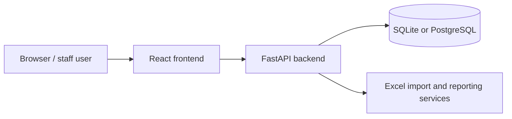
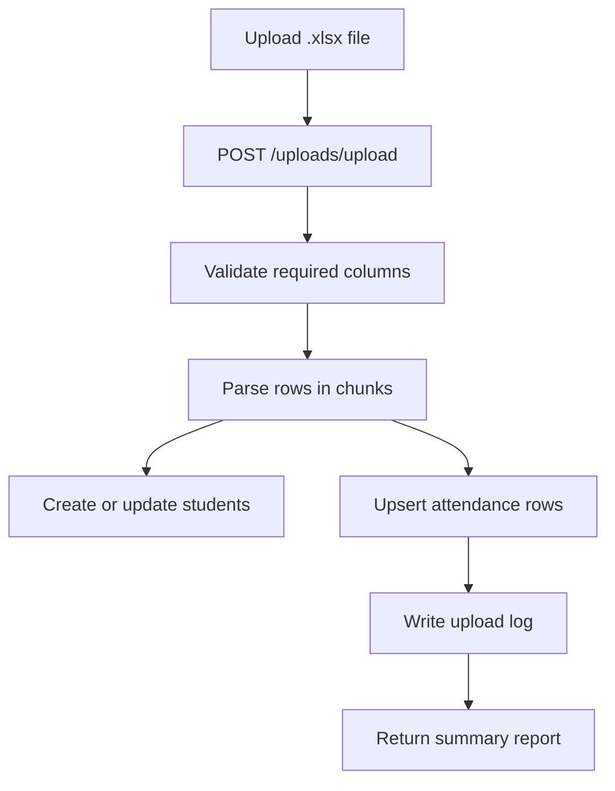

# School Attendance Analytics

School Attendance Analytics is a full-stack system for importing school attendance spreadsheets, reviewing and correcting attendance data, configuring lateness rules, and generating operational and executive reports.

## What It Does
- Imports `.xlsx` attendance exports into a backend database.
- Tracks students, class mappings, HEB calculations, absence reasons, upload history, and attendance overrides.
- Generates dashboard, attendance, rekap absensi, and tardiness reports.
- Runs locally with SQLite or PostgreSQL and also through Docker Compose.
- Supports a Portless-first WSL2 workflow plus a safe direct-port fallback.

## Architecture


## Stack
- Backend: Python 3.12, FastAPI, SQLAlchemy, Pydantic, Uvicorn, pandas, openpyxl
- Frontend: React 19, react-scripts 5, React Router, Tailwind CSS 4, Chart.js, Framer Motion, lucide-react
- Database: SQLite for local files, PostgreSQL 16 in `docker-compose.yml`
- Infrastructure: Docker, Docker Compose, Nginx, Portless, Agent Browser, WSL2-friendly shell scripts

## Repository Layout
- [`backend/`](backend/): API routers, settings, ORM models, services, and raw SQL migrations
- [`frontend/`](frontend/): React pages, shared components, API client, proxy hook, and Nginx config
- [`docs/`](docs/): WSL2 guidance, utility script notes, and operational references
- [`scratch/`](scratch/): one-off diagnostics and experiments
- Top-level `*.py`: reporting or repair utilities; several rewrite code or output files
- [`start-dev.sh`](start-dev.sh): preferred local launcher
- [`scripts/verify-browser.sh`](scripts/verify-browser.sh): Agent Browser smoke test

## Prerequisites
- Python 3.12
- Node.js 24+ for Portless mode
- npm
- Portless on the PATH for the default launcher mode
- Agent Browser on the PATH if you want browser verification
- Docker and Docker Compose for containerized development

## Quick Start
### Portless-first local development
```bash
./start-dev.sh
```

This starts the backend and frontend through Portless, prints stable `.localhost` URLs, and keeps worktree prefixes automatic.

If this is your first Portless session, run:
```bash
portless trust
```

### Browser smoke test
```bash
./start-dev.sh --verify-browser
```

This launches the app and then runs [`scripts/verify-browser.sh`](scripts/verify-browser.sh) against the live frontend URL.

### Legacy direct-port fallback
```bash
./start-dev.sh --no-portless
```

Use this only when you deliberately want localhost ports. The script will fail instead of killing an occupied port.

## Local Development Without Docker
```bash
cd backend
python3.12 -m venv .venv
source .venv/bin/activate
pip install -r requirements.txt
uvicorn src.main:app --reload --host 0.0.0.0 --port 8000
```

```bash
cd frontend
npm ci
REACT_APP_API_URL=http://localhost:8000 npm start
```

Open:
- Frontend: `http://localhost:3000`
- Backend API: `http://localhost:8000`
- OpenAPI docs: `http://localhost:8000/docs`
- Redoc: `http://localhost:8000/redoc`

## Docker Compose
```bash
docker compose up --build
```

Compose starts:
- Backend on `http://localhost:8000`
- Frontend on `http://localhost`
- PostgreSQL on the internal `db` service

The containerized frontend bundle uses `/api` as its browser API base. Nginx strips `/api/` before forwarding requests to the backend container.

## Portless URLs
- Frontend: `https://school-attendance.localhost`
- Backend: `https://api.school-attendance.localhost`
- Worktree prefixes are added automatically by Portless for linked worktrees.
- Use `portless get <name>` to retrieve the current URL and `portless list` to inspect active routes.

## Environment Variables
| Variable | Service | Required | Default | Description | Example |
| --- | --- | ---: | --- | --- | --- |
| `DATABASE_URL` | Backend | No | unset | SQLite or external PostgreSQL URL used when `POSTGRES_*` is not provided. | `sqlite:///./attendance.db` |
| `POSTGRES_USER` | Backend / Compose | No | `postgres` | PostgreSQL user for the Compose database service. | `postgres` |
| `POSTGRES_PASSWORD` | Backend / Compose | No | `development-only-change-me` | Development-only PostgreSQL password. Replace it in real deployments. | `change-me` |
| `POSTGRES_DB` | Backend / Compose | No | `absensi` | PostgreSQL database name for Compose. | `absensi` |
| `POSTGRES_HOST` | Backend / Compose | No | `db` | Compose hostname for the PostgreSQL service. | `db` |
| `POSTGRES_PORT` | Backend / Compose | No | `5432` | PostgreSQL port used by the backend container. | `5432` |
| `ENABLE_DESTRUCTIVE_OPERATIONS` | Backend | No | `false` | Enables guarded reset actions such as `POST /system/clear-data`. | `true` |
| `ALLOWED_ORIGINS` | Backend | No | `http://localhost:3000` | Comma-separated CORS origins for direct-port development. | `http://localhost:3000,http://127.0.0.1:3000` |
| `HOST` | Backend | No | `0.0.0.0` | Bind host used by the backend runtime. | `0.0.0.0` |
| `PORT` | Backend | No | `8000` | Bind port used by the backend runtime. | `8000` |
| `REACT_APP_API_URL` | Frontend | No | `http://localhost:8000` locally, `/api` in Docker and Portless mode | Build-time API base URL used by the React client. | `/api` |
| `DEV_USE_PORTLESS` | `start-dev.sh` | No | `true` | Chooses Portless as the default launcher mode. | `true` |
| `PORTLESS_FRONTEND_NAME` | `start-dev.sh` | No | `school-attendance` | Logical Portless route name for the frontend. | `school-attendance` |
| `PORTLESS_BACKEND_NAME` | `start-dev.sh` | No | `api.school-attendance` | Logical Portless route name for the backend. | `api.school-attendance` |
| `DEV_API_PROXY_TARGET` | `start-dev.sh` / CRA proxy | No | `http://localhost:8000` | Backend target used by `frontend/src/setupProxy.js`. | `https://api.school-attendance.localhost` |
| `DEV_VERIFY_BROWSER` | `start-dev.sh` | No | `false` | Runs the Agent Browser smoke test after startup. | `true` |
| `DEV_BROWSER_ARTIFACT_DIR` | `start-dev.sh` / browser smoke | No | `.artifacts/browser` | Stores screenshots and browser diagnostics. | `.artifacts/browser` |
| `DEV_BACKEND_HOST` | `start-dev.sh` fallback | No | `0.0.0.0` | Bind host used when Portless is disabled. | `0.0.0.0` |
| `DEV_BACKEND_PORT` | `start-dev.sh` fallback | No | `8000` | Backend port used when Portless is disabled. | `8000` |
| `DEV_FRONTEND_PORT` | `start-dev.sh` fallback | No | `3000` | Frontend port used when Portless is disabled. | `3000` |

## Database and Migrations
- The backend creates tables on startup with SQLAlchemy metadata.
- SQLite connections enable foreign keys, WAL mode, and related pragmas in `backend/src/core/database.py`.
- Historical schema changes live in `backend/migrations/` as raw SQL for SQLite and PostgreSQL.
- When PostgreSQL fields are set, the backend builds a SQLAlchemy URL from the separate connection parts instead of string-concatenating credentials.

## Excel Import Workflow


- The import expects the first worksheet to contain the required attendance columns.
- Only `.xlsx` files are accepted by the upload endpoint.
- A sample template is available at `GET /uploads/sample-template`.

## URLs
| Surface | Direct local dev | Portless dev | Docker |
| --- | --- | --- | --- |
| Frontend | `http://localhost:3000` | `https://school-attendance.localhost` | `http://localhost` |
| Backend API | `http://localhost:8000` | `https://api.school-attendance.localhost` | `http://localhost:8000` |
| Browser API base | `http://localhost:8000` | `/api` | `/api` |
| OpenAPI docs | `http://localhost:8000/docs` | `https://api.school-attendance.localhost/docs` | `http://localhost:8000/docs` |
| Redoc | `http://localhost:8000/redoc` | `https://api.school-attendance.localhost/redoc` | `http://localhost:8000/redoc` |

## Validation and Testing
- Backend smoke check: `cd backend && python3 -c "from src.main import app; assert app is not None"`
- Backend tests: `cd backend && python3 -m pytest -q`
- Frontend build: `cd frontend && npm run build`
- Browser smoke: `./scripts/verify-browser.sh`
- Compose config validation: `docker compose config`
- Markdown link validation: `python3 .github/scripts/check_markdown_links.py`

## Troubleshooting
- If Portless URLs do not resolve, run `portless trust`, then check `portless list` and `portless get <name>`.
- If Portless reports stale routes, prune them manually with `portless prune`; do not use `portless clean` as normal cleanup.
- If the frontend cannot reach the API in Portless mode, verify `DEV_API_PROXY_TARGET` and that `/api` is being proxied once.
- If uploads fail, confirm the workbook is `.xlsx` and that the required columns exist on the first sheet.
- If WSL2 file watching is unreliable, keep the repo on the Linux filesystem rather than `/mnt/c`.

## Security and Data Handling
- The app does not include a backend authentication layer in server code.
- `POST /system/clear-data` is disabled by default and requires explicit confirmation even when enabled.
- Treat imported spreadsheets, SQLite databases, browser artifacts, and generated Excel outputs as sensitive operational data.
- Keep development PostgreSQL credentials out of real deployments.

## Contribution Workflow
1. Read the relevant app and docs files first.
2. Make the smallest safe change.
3. Update or add tests when behavior changes.
4. Run the most relevant verification command.
5. For user-visible frontend changes, run the browser smoke test when Agent Browser is available.
6. Document any data migrations or operational caveats in the PR.

## Further Reading
- [Backend guide](backend/README.md)
- [Frontend guide](frontend/README.md)
- [WSL2 / DevOps guide](docs/WSL2_DEVOPS.md)
- [Utility scripts](docs/UTILITY_SCRIPTS.md)
- [Agent instructions](AGENTS.md)
