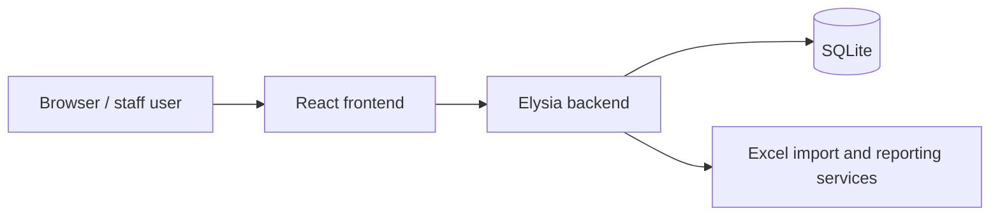
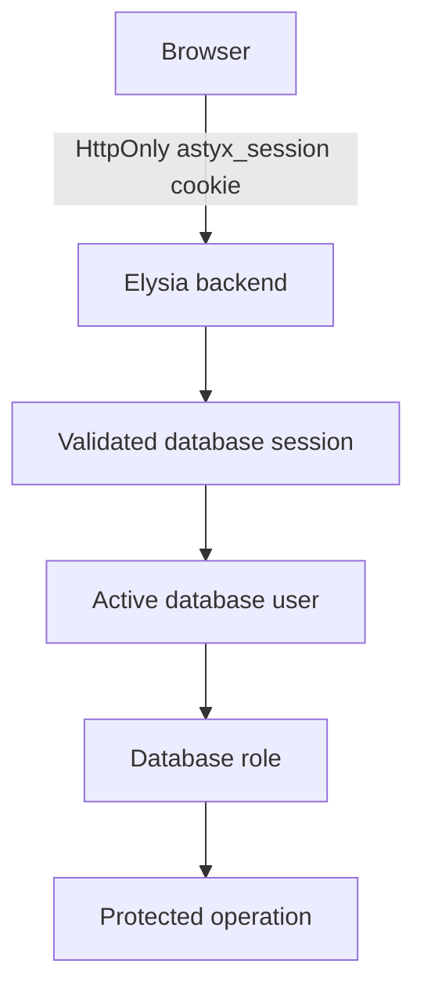
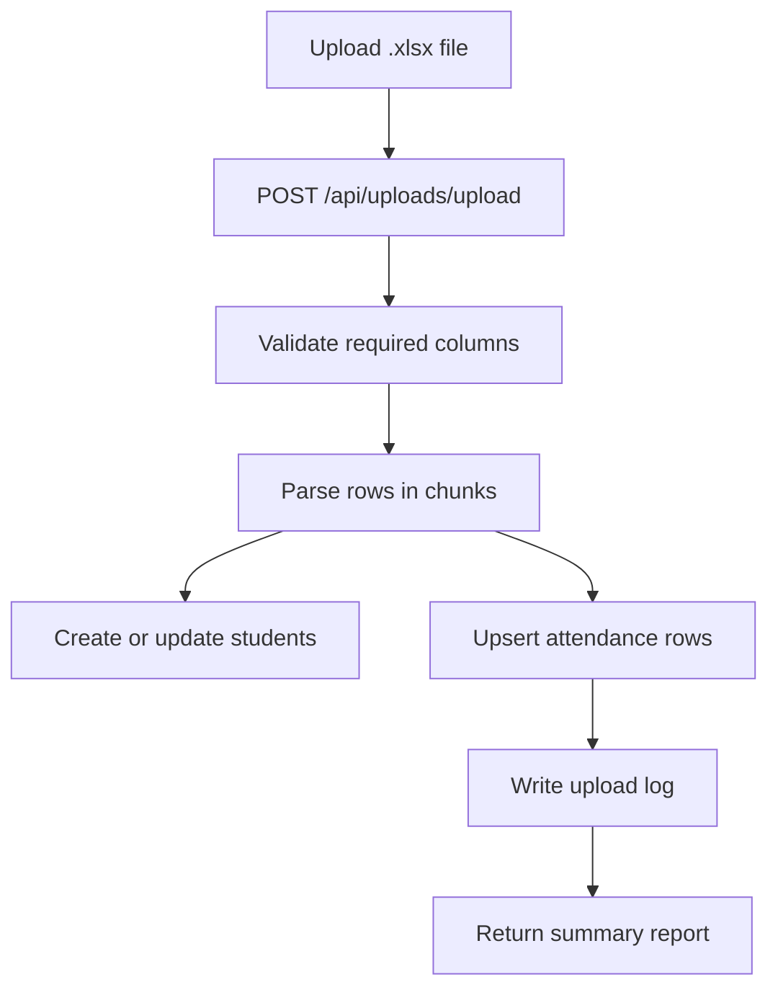

# OperatorOS

OperatorOS is an offline-first school attendance and academic analytics system.
Current developer and operational guidance is indexed in [docs/README.md](docs/README.md);
[AGENTS.md](AGENTS.md) is the authoritative execution contract.

The prior **`v0.9.0-platform-foundation`** inventory, security review, and release notes remain the historical Phase 9 baseline. The experimental Tauri desktop shell and its Phase 9.6/11 acceptance gates were removed on 2026-08-20.

The current runtime schema is S4.3 (`20260725_s43`); S4.2 is the fresh-bootstrap
baseline. Local development uses a disposable configured database—never
`backend/attendance.db`, which is protected operational data.

## What It Does
- Imports `.xlsx` attendance exports into a backend database.
- Tracks students, class mappings, HEB calculations, absence reasons, upload history, and attendance overrides.
- Generates dashboard, attendance, rekap absensi, and tardiness reports.
- Provides Management Analytics with PDF/Excel export for attendance, lateness, grade, and Below-KKM review.
- Supports database-backed KKM thresholds and custom academic term date ranges.
- Tracks academic interventions created from Below-KKM alerts.
- Runs locally as a SQLite-backed desktop/local application.

## Architecture

```mermaid
flowchart LR
  Browser[Browser / staff user]
  FE[React frontend]
  API[Elysia backend]
  DB[(SQLite)]
  SVC[Excel import and reporting services]

  Browser --> FE
  FE --> API
  API --> DB
  API --> SVC
```

## Security Architecture

OperatorOS uses a layered local security model:

1. backup integrity protection;
2. guarded restore with safety snapshot and rollback;
3. database-backed user identity and server-side sessions;
4. role-based backend authorization; and
5. authentication, authorization-denial, and restore lifecycle audit logging.


```mermaid
flowchart TD
  Browser["Browser"] -->|"HttpOnly astyx_session cookie"| API["Elysia backend"]
  API --> Session["Validated database session"]
  Session --> User["Active database user"]
  User --> Role["Database role"]
  Role --> Protected["Protected operation"]
```

Only the backend grants access. Frontend identity and role state are navigation conveniences. Client fields such as `request.role`, `reviewed_by`, `entered_by`, and `uploaded_by` are untrusted metadata, not authorization evidence. See [Identity and Authentication](docs/security/identity-authentication.md) and [Backup and Restore Security](docs/security/backup-restore.md).

## Stack
- Primary backend: Bun, TypeScript, Elysia, Drizzle, SQLite, ExcelJS
- Rollback/reference backend: Python 3.12, FastAPI, SQLAlchemy, Pydantic, Uvicorn, pandas, openpyxl
- Frontend: React 19, Vite, React Router, Tailwind CSS 4, Chart.js, Framer Motion, lucide-react
- Database: SQLite
- Runtime: local Elysia backend and React browser UI

## Repository Layout
- [`backend/`](backend/): API routers, settings, ORM models, services, and raw SQL migrations
- [`frontend/`](frontend/): React pages, shared components, API client, and Nginx config
- [`docs/`](docs/): WSL2 guidance, utility script notes, and operational references
- [`scratch/`](scratch/): one-off diagnostics and experiments
- Top-level `*.py`: reporting or repair utilities; several rewrite code or output files
- [`start-dev.sh`](start-dev.sh): combined dev launcher starting Vite frontend and Elysia backend
- [`scripts/start-backend.sh`](scripts/start-backend.sh): standalone Elysia launcher with FastAPI fallback
- [`scripts/verify-browser.sh`](scripts/verify-browser.sh): Agent Browser smoke test

## Core validation

```bash
make test-fast
make test-pr
make test-release
make fresh-db-parity
```

`test-fast` is changed-path-aware; `test-pr` is the ordinary PR gate; and
`test-release` is for release/schema/startup-sensitive work. OpenAPI contracts
are generated and drift-checked through the frontend package scripts. See
[Contributing](CONTRIBUTING.md), [test strategy](docs/testing/TEST_STRATEGY.md),
[frontend architecture](docs/architecture/FRONTEND_ARCHITECTURE.md), and
[database operations](docs/operations/DATABASE_OPERATIONS.md).

## Prerequisites
- mise-en-place (mise) >= 2024.1.0 — controls runtime versions (Bun, Python)
- Bun 1.4.0 (installed via `mise install`; `frontend/bun.lock` remains package lockfile)
- Python 3.12.3 (installed via `mise install`)
- Agent Browser on the PATH if you want browser verification

## Quick Start
Direct Bun/Vite and Bun/Elysia processes are the local-development workflow.
The supported runtime is a local Elysia backend with the React frontend in a
browser and a SQLite database. FastAPI remains available as a rollback and
reference backend. Containers are not required.

### Local Development Launcher
```bash
./start-dev.sh
```

The launcher defaults to Elysia. It validates Bun, locked dependencies, the
Python environment used for managed database and session state, and ports
before starting anything. Set `OPERATOROS_BACKEND=fastapi` for the fallback.
The launcher displays the ready banner only after both health checks pass and
stores service logs under `.runtime/operatoros-dev/`. Press `Ctrl+C` to stop
both process groups cleanly.

On a fresh database, open the frontend and create the first administrator on the setup screen. OperatorOS then closes setup permanently and redirects to normal login. There are no default credentials.

For a trusted headless/local shell, use the same provisioning service interactively:

```bash
cd backend
PYTHONPATH=src .venv/bin/python -m cli create-admin
```

Passwords are read with hidden terminal input and are never accepted as command-line arguments.

Run diagnostics without starting services:

```bash
./start-dev.sh --check
```

Initial runtime and dependency setup:

```bash
mise install
mise run doctor
cd backend
python -m venv .venv
.venv/bin/python -m pip install -r requirements.txt
cd ../frontend
bun ci
```

`mise install` uses `mise.lock` for exact versions. `mise run doctor` verifies Bun, Python, and lockfile contracts. Bun remains the package manager authority; mise only installs the Bun runtime.

### Browser smoke test
```bash
./scripts/verify-browser.sh
```

This launches the app and then runs [`scripts/verify-browser.sh`](scripts/verify-browser.sh) against the live frontend URL (`http://127.0.0.1:5173`).

## Local Development Without start-dev.sh
```bash
cd backend-ts
bun install --frozen-lockfile
DATABASE_URL=sqlite:///./operatoros.db AUTH_COOKIE_SECRET='use-a-local-secret-with-at-least-32-characters' bun run src/server.ts
```

Use `OPERATOROS_BACKEND=fastapi ./start-dev.sh` for the FastAPI fallback.

```bash
cd frontend
bun install
bun run dev
```

Open:
- Frontend: `http://127.0.0.1:5173`
- Backend API: `http://127.0.0.1:8000`
- OpenAPI docs: `http://127.0.0.1:8000/openapi`
- FastAPI fallback docs: `http://127.0.0.1:8000/docs`

## Environment Variables

For `./start-dev.sh`, the persistent database path is resolved from the repository identity and `XDG_DATA_HOME` (or `OPERATOROS_DEV_DATA_DIR` when intentionally configured). The launcher exports that canonical SQLite URL for every managed session, warns when inherited `DATABASE_URL` or `backend/.env` configuration could drift, and creates one persistent local authentication secret. Outside managed development, explicit `DATABASE_URL`, `POSTGRES_*`, and `AUTH_COOKIE_SECRET` values retain their established behavior.

| Variable | Service | Required | Default | Description | Example |
| --- | --- | ---: | --- | --- | --- |
| `DATABASE_URL` | Backend | Yes outside launcher-owned development | unset | SQLite URL. PostgreSQL URLs and legacy `POSTGRES_*` settings are rejected. | `sqlite:///./operatoros.db` |
| `ENABLE_DESTRUCTIVE_OPERATIONS` | Backend | No | `false` | Enables guarded reset actions such as `POST /api/system/clear-data`. | `true` |
| `AUTH_COOKIE_SECRET` | Backend | Yes | unset | Persistent secret used to derive server-side session token digests. Must contain at least 32 characters; store only in protected backend configuration and share across workers. | *(secret value)* |
| `ASTRYX_SETUP_TOKEN` | Setup API | No for direct loopback | unset | Optional high-entropy external token protecting first-run web provisioning. | *(secret value)* |
| `COOKIE_SECURE` | Backend | No | `false` | Sets the authentication cookie Secure attribute; use `false` for localhost HTTP and `true` for HTTPS. | `true` |
| `SESSION_IDLE_TIMEOUT_HOURS` | Backend | No | `6` | Idle session lifetime for the offline deployment profile. | `6` |
| `SESSION_ABSOLUTE_TIMEOUT_HOURS` | Backend | No | `24` | Absolute session lifetime. | `24` |
| `MAX_FAILED_LOGIN_ATTEMPTS` | Backend | No | `5` | Consecutive failed logins allowed before account lock. | `5` |
| `ACCOUNT_LOCK_MINUTES` | Backend | No | `30` | Account lock duration after the failed-login threshold. | `30` |
| `BACKEND_WORKERS` | Backend | No | `1` | Declares the backend worker count used by scheduler and restore safety checks. | `1` |
| `RESTORE_SINGLE_WORKER_REQUIRED` | Backend | No | `true` | Rejects restore unless `BACKEND_WORKERS=1`; keep enabled until approved cross-process locking exists. | `true` |
| `ALLOWED_ORIGINS` | Backend | No | `http://localhost:3000,http://127.0.0.1:3000,http://localhost:5173,http://127.0.0.1:5173` | Comma-separated CORS origins for development. | `http://localhost:5173,http://127.0.0.1:5173` |
| `HOST` | Backend | No | `0.0.0.0` | Bind host used by the backend runtime. | `0.0.0.0` |
| `PORT` | Backend | No | `8000` | Bind port used by the backend runtime. | `8000` |
| `OPERATOROS_BACKEND` | Launcher/E2E | No | `elysia` | Selects the normal Elysia backend or the documented `fastapi` fallback. | `fastapi` |
| `VITE_API_BASE_URL` | Frontend | No | unset | Build-time API base URL used by the Vite client. If empty, uses same-origin with the proxy for the selected backend. | `http://localhost:8000` |

## Database and Migrations
- Database restore requires an authenticated administrator, an identity-compatible backup with an active administrator, exact confirmation, and single-worker runtime. Successful restore revokes every restored session and requires all operators to sign in again. Multi-worker deployments fail closed because the repository has no approved cross-process restore lock.
- Fresh, absent databases bootstrap through the explicit S4.2-to-S4.3 sequence;
  existing databases are validated and are never silently migrated at startup.
- SQLite connections enable foreign keys, WAL mode, and related pragmas in `backend/src/core/database.py`.
- Historical schema changes, including retired PostgreSQL evaluation artifacts,
  remain in `backend/migrations/` as audit evidence. Only SQLite migrations are
  part of the supported runtime.

## Management Analytics and Academic Config
- Management Analytics is available at `/analytics`.
- Dashboard data comes from `GET /api/analytics/management-summary`.
- Filtered management reports can be downloaded from:
  - `GET /api/analytics/management-summary/export/pdf`
  - `GET /api/analytics/management-summary/export/excel`
- KKM thresholds and term date ranges are configured in `/academic-management` under `KKM & Term Settings`.
- Academic config APIs are canonical under `/api/academic-config/...`.
- Academic interventions can be created and updated from Below-KKM alerts in Management Analytics.
- Intervention APIs are canonical under `/api/academic-interventions/...`.
- If no custom KKM threshold applies, analytics preserves the legacy fallback threshold `85.0`.
- If no custom term range exists, analytics preserves the default Term 1-4 date mapping.

## Excel Import Workflow

```mermaid
flowchart TD
  A[Upload .xlsx file] --> B[POST /api/uploads/upload]
  B --> C[Validate required columns]
  C --> D[Parse rows in chunks]
  D --> E[Create or update students]
  D --> F[Upsert attendance rows]
  F --> G[Write upload log]
  G --> H[Return summary report]
```

- The import expects the first worksheet to contain the required attendance columns.
- Only `.xlsx` files are accepted by the upload endpoint.
- A sample template is available at `GET /api/uploads/sample-template`.

## Surface URLs
| Surface | Local development | Docker |
| --- | --- | --- |
| Frontend | `http://127.0.0.1:5173` | `http://localhost` |
| Backend API | `http://127.0.0.1:8000` | `http://localhost:8000` |
| OpenAPI docs | `http://127.0.0.1:8000/docs` | `http://localhost:8000/docs` |
| Redoc | `http://127.0.0.1:8000/redoc` | `http://localhost:8000/redoc` |

## Validation and Testing

The standardized E2E workflow uses isolated synthetic data and runtime-selected ports; [`e2e/README.md`](e2e/README.md) is the authoritative guide.

- E2E infrastructure validation: `make e2e-validate`
- Local blocking smoke: `timeout 300 make e2e-smoke`
- Do not run `make e2e-full` locally without explicit owner approval; it is guarded for GitHub Actions.
- Backend smoke check: `cd backend && python3 -c "from src.main import app; assert app is not None"`
- Backend tests: `cd backend && pytest`
- Frontend build: `cd frontend && bun run build`
- Browser smoke: `./scripts/verify-browser.sh`
- SQLite-only runtime contract: `backend/.venv/bin/python -m pytest -q backend/tests/test_sqlite_only_runtime.py`

## Troubleshooting
- If the Vite dev server fails, verify `frontend/node_modules/` exists. Run `cd frontend && bun install` if needed.
- If uploads fail, confirm the workbook is `.xlsx` and that the required columns exist on the first sheet.
- If WSL2 file watching is unreliable, keep the repo on the Linux filesystem rather than `/mnt/c`.

## Security and Data Handling
- OperatorOS uses database-backed users, revocable server-side sessions, an HttpOnly cookie, and Argon2id password hashes.
- Backend roles are `admin` and `staff`; client-provided roles never authorize a request.
- `POST /api/system/clear-data` is disabled by default and requires an authenticated administrator plus exact confirmation when enabled.
- Backup restore additionally requires identity-compatible data, an active administrator, single-worker runtime, and mandatory reauthentication after success.
- Treat imported spreadsheets, SQLite databases, browser artifacts, and generated Excel outputs as sensitive operational data.
- Keep development PostgreSQL credentials out of real deployments.

Implemented security does not include MFA, SSO, OAuth, LDAP, password-reset email, cloud identity, encrypted backups, distributed restore locking, or a granular permission matrix. There is currently no supported user-administration UI or CLI.

## Contribution Workflow
1. Read the relevant app and docs files first.
2. Make the smallest safe change.
3. Update or add tests when behavior changes.
4. Run the most relevant verification command.
5. For user-visible frontend changes, run the browser smoke test when Agent Browser is available.
6. Document any data migrations or operational caveats in the PR.

## Further Reading
- [Backend guide](backend/README.md)
- [Frontend guide](frontend/README.md)
- [WSL2 / DevOps guide](docs/WSL2_DEVOPS.md)
- [Utility scripts](docs/UTILITY_SCRIPTS.md)
- [Identity and authentication](docs/security/identity-authentication.md)
- [Backup and restore security](docs/security/backup-restore.md)
- [User administration status](docs/security/user-administration.md)
- [Agent instructions](AGENTS.md)
