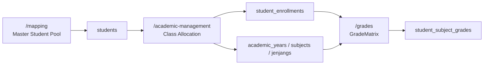

# Academic Management Workflow

This guide explains the operational flow for setting up and using Grade Ledger in the school-attendance-analytics app. It is written for school admins and operators who need a reliable sequence from master student data to score entry.

## 1. Purpose

Use this workflow to prepare the Grade Ledger so score entry works correctly and saved values can be loaded back later. The goal is to keep student identity, academic setup, class allocation, and grade entry in the right place.

If the setup is incomplete, the Grade Matrix may show missing dropdowns or empty rows. This guide explains how to avoid that.

## 2. Page Responsibilities

| Page | Main Purpose | Main Table(s) |
|---|---|---|
| `/mapping` | Student identity and scanner mapping | `students` |
| `/academic-management` → `Calendar & Subjects` | Academic years and subjects | `academic_years`, `subjects`, `jenjangs` |
| `/academic-management` → `Class Allocation` | Student enrollment into academic context | `student_enrollments` |
| `/grades` | Score entry and Grade Matrix | `student_enrollments`, `student_subject_grades` |

Related operator docs:

- [WSL2 DevOps Guide](WSL2_DEVOPS.md)
- [Backup and Restore Scheme](BACKUP_SCHEME.md)

## 3. Recommended Operating Sequence

Use this order:

1. Add or confirm students in `/mapping`
2. Open `/academic-management`
3. Create or confirm the active academic year
4. Create or confirm subjects for the selected jenjang
5. Use Class Allocation to enroll students into a target class
6. Open `/grades`
7. Select academic year, jenjang, and subject
8. Enter scores in `GradeMatrix`
9. Click `Save Ledger Matrix`
10. Refresh and confirm saved scores reload

## 4. Step-by-Step Workflow

### Step 1: Prepare the master student pool

Go to `/mapping` and make sure the students exist in the master pool.

What this page owns:

- student identity
- scanner or RFID mapping
- legacy class fields such as `jenjang` and `class_name`

What this page does not do:

- it does not create Grade Ledger rows
- it does not allocate students into academic-year class contexts

### Step 2: Open Academic Management

Go to `/academic-management`.

This page has two tabs:

- `Calendar & Subjects`
- `Class Allocation`

Use `Calendar & Subjects` first if the academic setup is incomplete.

### Step 3: Create or confirm the academic year

In `Calendar & Subjects`, check the Academic Year list.

If the needed year is missing:

- create it
- set the correct start and end dates
- mark it as active if this is the current year
- set `is_default` only for the year you want as the default

### Step 4: Create or confirm subjects

Still in `Calendar & Subjects`, select the correct jenjang first.

Then confirm the subject list for that jenjang.

If the subject is missing:

- create the subject for the selected jenjang
- keep `supports_sumatif` and `supports_formatif` aligned with the school’s needs

### Step 5: Allocate students into a class

Open `Class Allocation` inside `/academic-management`.

Then:

1. Select the academic year
2. Select the jenjang
3. Optionally use the Source Class filter
4. Enter the target class name, for example `1-A`
5. Select the candidate students
6. Click `Enroll`
7. Confirm the students appear in Current Enrollment

This creates `student_enrollments` rows for the selected academic context.

### Step 6: Open Grade Ledger

Go to `/grades`.

Select:

- academic year
- jenjang
- subject

When the setup is complete, the Grade Matrix will show enrolled students and assessment columns.

### Step 7: Enter and save scores

Type grades directly into the editable matrix cells.

Rules:

- scores must stay between `0.0` and `100.0`
- leave a cell blank if the score is unknown
- blank cells are saved as `null`

After editing:

1. Click `Save Ledger Matrix`
2. Refresh the page or reload the ledger data
3. Confirm the saved values come back correctly

## 5. Understanding Source Class vs Target Class

These two terms are not the same.

### Source Class

- comes from the master student or mapping data
- used only to filter candidate students in Class Allocation
- examples: `P1A`, `P1B`, `P2`

### Target Class

- written into `student_enrollments`
- used by Grade Ledger
- examples: `1-A`, `2-B`

Changing the target enrollment class does not rewrite the master student identity in `/mapping`.

## 6. Why the Grade Matrix May Be Empty

Common causes:

- no academic year exists
- no default or active academic year exists
- no jenjang exists
- no subject exists for the selected jenjang
- no students have been allocated in Class Allocation
- the selected subject does not match the selected jenjang
- the browser is showing stale data and needs refresh

## 7. How to Fix Missing Academic Years or Subjects

If the Academic Year or Subject dropdown is empty:

1. Go to `/academic-management`
2. Open `Calendar & Subjects`
3. Create the missing academic year
4. Create the subject for the correct jenjang
5. Return to `/grades`
6. Select the year, jenjang, and subject again

## 8. How to Allocate Students to a Class

1. Go to `/academic-management`
2. Open `Class Allocation`
3. Select the academic year
4. Select the jenjang
5. Choose a source class filter if needed
6. Enter the target class name
7. Select the candidate students
8. Click `Enroll`
9. Confirm the students appear in Current Enrollment

If the candidate pool is empty, check the source filter and whether the students were already enrolled.

## 9. How to Enter and Save Grades

1. Go to `/grades`
2. Select academic year
3. Select jenjang
4. Select subject
5. Wait for the Grade Matrix to load
6. Click the editable cells
7. Enter scores between `0.0` and `100.0`
8. Leave a cell blank for `null`
9. Click `Save Ledger Matrix`
10. Refresh and confirm the values reload

If the save button is disabled, check whether a valid row, year, jenjang, and subject are selected.

## 10. Data Ownership and Safety Rules

- `/mapping` owns the master student identity pool
- `/academic-management` owns Grade Ledger setup and allocation
- `/grades` owns score entry
- `students.class_name` is legacy mapping data, not the Grade Ledger class source of truth
- Grade Ledger class assignment comes from `student_enrollments`
- the normal app UI does not expose a student hard-delete route
- full system reset is guarded and destructive

## 11. Troubleshooting

| Symptom | Likely Cause | Fix |
|---|---|---|
| Academic Year dropdown is empty | No academic year exists | Create one in Academic Management |
| Subject dropdown is empty | No subject for selected jenjang | Create subject for that jenjang |
| Candidate Pool is empty | Students already enrolled or source filter too narrow | Change source filter or check current enrollment |
| Grade Matrix has no rows | No students enrolled for selected context | Use Class Allocation |
| Saved score disappears after refresh | Save failed or wrong context selected | Check the alert and selected year, jenjang, and subject |
| 404 on grade endpoints | API path or proxy problem | Check the Grade Ledger API wrapper and Portless path convention |

## 12. Developer Notes

- Grade Ledger rows come from `student_enrollments`
- scores are stored in `student_subject_grades`
- `null` scores are valid and must not become `0`
- duplicate saves should update existing grade rows
- source class filtering must not be confused with target enrollment class
- Portless Grade Ledger API paths may use the existing `/api/api/grades/...` convention in frontend wrappers

## Workflow Diagram

