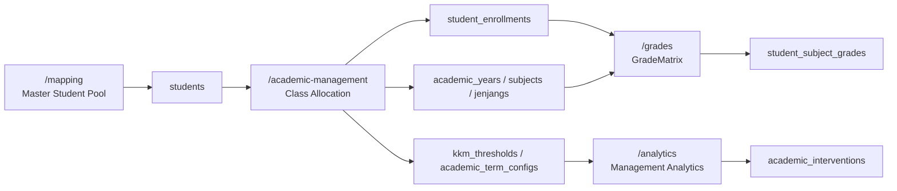

# Academic Management Workflow

This guide explains the operational flow for setting up and using Grade Ledger in the school-attendance-analytics app. It is written for school admins and operators who need a reliable sequence from master student data to score entry.

## 1. Purpose

Use this workflow to prepare the Grade Ledger so score entry works correctly and saved values can be loaded back later. The goal is to keep student identity, academic setup, class allocation, and grade entry in the right place.

If the setup is incomplete, the Grade Matrix may show missing dropdowns or empty rows. This guide explains how to avoid that.

## 2. Page Responsibilities

| Page | Main Purpose | Main Table(s) |
|---|---|---|
| `/mapping` | Student identity and scanner mapping | `students` |
| `/academic-management` → `Calendar & Subjects` | Academic years and subjects | `academic_years`, `subjects`, `jenjangs` |
| `/academic-management` → `Class Allocation` | Student enrollment into academic context | `student_enrollments` |
| `/academic-management` → `KKM & Term Settings` | Academic thresholds and effective term ranges | `kkm_thresholds`, `academic_term_configs` |
| `/academic-management` → `Report Builder` | Reusable report templates, branding, and export presets | `report_templates`, `report_branding_configs` |
| `/grades` | Score entry and Grade Matrix | `student_enrollments`, `student_subject_grades` |
| `/analytics` → `Below-KKM Alerts & Academic Interventions` | Follow-up workflow for students below KKM | `academic_interventions` |

Related operator docs:

- [WSL2 DevOps Guide](WSL2_DEVOPS.md)
- [Backup and Restore Scheme](BACKUP_SCHEME.md)

## 3. Recommended Operating Sequence

Use this order:

1. Add or confirm students in `/mapping`
2. Open `/academic-management`
3. Create or confirm the active academic year
4. Create or confirm subjects for the selected jenjang
5. Configure KKM thresholds and term ranges if the defaults are not sufficient
6. Use Class Allocation to enroll students into a target class
7. Open `/grades`
8. Select academic year, jenjang, and subject
9. Enter scores in `GradeMatrix`
10. Click `Save Ledger Matrix`
11. Refresh and confirm saved scores reload
12. Review Below-KKM alerts in `/analytics`
13. Create or update academic interventions for students requiring follow-up

## 4. Step-by-Step Workflow

### Step 1: Prepare the master student pool

Go to `/mapping` and make sure the students exist in the master pool.

What this page owns:

- student identity
- scanner or RFID mapping
- legacy class fields such as `jenjang` and `class_name`

What this page does not do:

- it does not create Grade Ledger rows
- it does not allocate students into academic-year class contexts

### Step 2: Open Academic Management

Go to `/academic-management`.

This page has two tabs:

- `Calendar & Subjects`
- `Class Allocation`
- `KKM & Term Settings`
- `Report Builder`

Use `Calendar & Subjects` first if the academic setup is incomplete.

### Step 3: Create or confirm the academic year

In `Calendar & Subjects`, check the Academic Year list.

If the needed year is missing:

- create it
- set the correct start and end dates
- mark it as active if this is the current year
- set `is_default` only for the year you want as the default

### Step 4: Create or confirm subjects

Still in `Calendar & Subjects`, select the correct jenjang first.

Then confirm the subject list for that jenjang.

If the subject is missing:

- create the subject for the selected jenjang
- keep `supports_sumatif` and `supports_formatif` aligned with the school’s needs

### Step 5: Configure KKM thresholds and term ranges

Open `KKM & Term Settings` inside `/academic-management`.

This tab owns two configuration areas:

- **KKM thresholds:** database-backed thresholds for academic year, optional jenjang, optional subject, and assessment type.
- **Effective term mapping:** custom Term 1-4 date ranges for the selected academic year.

If no custom KKM threshold matches a student/subject/assessment context, Management Analytics uses the legacy fallback threshold `85.0`. If no custom term exists, the system uses the default academic-year mapping:

- Term 1: July 1 to September 30
- Term 2: October 1 to December 31
- Term 3: January 1 to March 31
- Term 4: April 1 to June 30

Rules:

- KKM thresholds must be between `0.0` and `100.0`.
- Assessment type must be `sumatif`, `formatif`, or `overall`.
- Term numbers must be 1-4.
- Term start date must be on or before end date.
- Custom term ranges must stay within the academic year and must not overlap another effective term range.
- Restoring a term default deletes the custom term row only; it does not modify grades, attendance, students, or enrollments.

### Step 5b: Configure report templates

Open `Report Builder` inside `/academic-management`.

Use this tab to:

- create or edit reusable report templates
- toggle section visibility
- reorder report sections
- configure branding colors and text
- define default filters and export options
- preview the resolved export plan before using it in Management Analytics

Report Builder only changes export presentation. It does not modify attendance, grades, interventions, or academic configuration data.

### Step 6: Allocate students into a class

Open `Class Allocation` inside `/academic-management`.

Then:

1. Select the academic year
2. Select the jenjang
3. Optionally use the Source Class filter
4. Enter the target class name, for example `1-A`
5. Select the candidate students
6. Click `Enroll`
7. Confirm the students appear in Current Enrollment

This creates `student_enrollments` rows for the selected academic context.

### Step 7: Open Grade Ledger

Go to `/grades`.

Select:

- academic year
- jenjang
- subject

When the setup is complete, the Grade Matrix will show enrolled students and assessment columns.

### Step 8: Enter and save scores

Type grades directly into the editable matrix cells.

Rules:

- scores must stay between `0.0` and `100.0`
- leave a cell blank if the score is unknown
- blank cells are saved as `null`

After editing:

1. Click `Save Ledger Matrix`
2. Refresh the page or reload the ledger data
3. Confirm the saved values come back correctly

### Step 9: Create academic interventions from Below-KKM alerts

Go to `/analytics` and review `Below-KKM Alerts & Academic Interventions`.

Each alert is still calculated by Management Analytics from Grade Ledger averages and effective KKM configuration. The intervention workflow adds an action record on top of that alert. It does not change the score, threshold, attendance, student, or enrollment record.

For each alert:

1. Click `Create Intervention` when no active intervention exists
2. Set status and priority
3. Assign an owner if known
4. Enter the planned action
5. Add notes and a follow-up date if needed
6. Save the intervention

When an active intervention already exists, click `View / Update Intervention` to update progress.

Supported statuses:

- `open`
- `in_progress`
- `monitoring`
- `resolved`
- `closed`

Supported priorities:

- `low`
- `medium`
- `high`
- `urgent`

The system prevents duplicate active interventions for the same student, academic year, subject, assessment type, and term while an existing row is `open`, `in_progress`, or `monitoring`. A new intervention is allowed after the previous row is `resolved` or `closed`.

## 5. Understanding Source Class vs Target Class

These two terms are not the same.

### Source Class

- comes from the master student or mapping data
- used only to filter candidate students in Class Allocation
- examples: `P1A`, `P1B`, `P2`

### Target Class

- written into `student_enrollments`
- used by Grade Ledger
- examples: `1-A`, `2-B`

Changing the target enrollment class does not rewrite the master student identity in `/mapping`.

## 6. Why the Grade Matrix May Be Empty

Common causes:

- no academic year exists
- no default or active academic year exists
- no jenjang exists
- no subject exists for the selected jenjang
- no students have been allocated in Class Allocation
- the selected subject does not match the selected jenjang
- the browser is showing stale data and needs refresh

## 7. How to Fix Missing Academic Years or Subjects

If the Academic Year or Subject dropdown is empty:

1. Go to `/academic-management`
2. Open `Calendar & Subjects`
3. Create the missing academic year
4. Create the subject for the correct jenjang
5. Return to `/grades`
6. Select the year, jenjang, and subject again

## 8. How to Allocate Students to a Class

1. Go to `/academic-management`
2. Open `Class Allocation`
3. Select the academic year
4. Select the jenjang
5. Choose a source class filter if needed
6. Enter the target class name
7. Select the candidate students
8. Click `Enroll`
9. Confirm the students appear in Current Enrollment

If the candidate pool is empty, check the source filter and whether the students were already enrolled.

## 9. How to Enter and Save Grades

1. Go to `/grades`
2. Select academic year
3. Select jenjang
4. Select subject
5. Wait for the Grade Matrix to load
6. Click the editable cells
7. Enter scores between `0.0` and `100.0`
8. Leave a cell blank for `null`
9. Click `Save Ledger Matrix`
10. Refresh and confirm the values reload

If the save button is disabled, check whether a valid row, year, jenjang, and subject are selected.

## 10. Data Ownership and Safety Rules

- `/mapping` owns the master student identity pool
- `/academic-management` owns Grade Ledger setup and allocation
- `/academic-management` -> `KKM & Term Settings` owns KKM and term configuration only
- `/grades` owns score entry
- `/analytics` owns intervention creation and progress updates for Below-KKM follow-up
- `students.class_name` is legacy mapping data, not the Grade Ledger class source of truth
- Grade Ledger class assignment comes from `student_enrollments`
- KKM configuration does not create, update, or delete grade records
- term configuration does not create, update, or delete attendance records
- intervention workflow creates or updates only `academic_interventions`
- intervention records snapshot student, class, subject, threshold, and average values for audit readability
- the normal app UI does not expose a student hard-delete route
- full system reset is guarded and destructive

## 11. Troubleshooting

| Symptom | Likely Cause | Fix |
|---|---|---|
| Academic Year dropdown is empty | No academic year exists | Create one in Academic Management |
| Subject dropdown is empty | No subject for selected jenjang | Create subject for that jenjang |
| Management Analytics uses fallback KKM | No matching KKM threshold exists | Add a threshold in KKM & Term Settings |
| Term dropdown shows default dates | No custom term exists for that academic year | Add or edit the term in KKM & Term Settings |
| Historical Trends forecast is missing | Fewer than 2 populated historical periods exist | Add/import more period data or treat the warning as expected |
| Historical Trends confidence is low | Only 2 historical periods are available | Use the estimate conservatively and collect more term history |
| Intervention Impact score delta is blank | Baseline or latest score is missing | Confirm the intervention was created from a Below-KKM alert and current Grade Ledger score exists |
| Intervention Impact risk is critical | Multiple deterministic risk factors are present | Review risk reasons, prioritize overdue follow-up, and update the intervention plan |
| Term save fails with overlap warning | Date range conflicts with another effective term | Adjust start/end dates so ranges do not overlap |
| Create Intervention is blocked as duplicate | Active intervention already exists for the same Below-KKM context | Update the existing intervention or resolve/close it first |
| Below-KKM alert shows no intervention | No active intervention exists for that alert context | Create an intervention from the alert row |
| Candidate Pool is empty | Students already enrolled or source filter too narrow | Change source filter or check current enrollment |
| Grade Matrix has no rows | No students enrolled for selected context | Use Class Allocation |
| Saved score disappears after refresh | Save failed or wrong context selected | Check the alert and selected year, jenjang, and subject |
| 404 on grade endpoints | API path or proxy problem | Check the Grade Ledger API wrapper and Portless path convention |

## 12. Developer Notes

- Grade Ledger rows come from `student_enrollments`
- scores are stored in `student_subject_grades`
- KKM thresholds are stored in `kkm_thresholds`
- custom term ranges are stored in `academic_term_configs`
- intervention workflow rows are stored in `academic_interventions`
- `null` scores are valid and must not become `0`
- duplicate saves should update existing grade rows
- source class filtering must not be confused with target enrollment class
- Grade Ledger API paths are canonical under `/api/grades/...` in frontend wrappers
- Academic config API paths are canonical under `/api/academic-config/...`
- Academic intervention API paths are canonical under `/api/academic-interventions/...`
- **Phase 17 Parity QA Test Coverage:** Always verify changes by running backend pytest regression tests in [test_report_parity.py](../backend/tests/test_report_parity.py). These assertions guarantee exact numerical alignment between backend JSON summary payloads, ReportLab vector PDFs, and editable Excel files.
- **Phase 18 Historical Trend Coverage:** Historical trends are served from `/api/analytics/historical-trends` and rendered in Management Analytics under `Historical Trends`. Forecasts are deterministic estimates only and must expose method, history point count, confidence, and data sufficiency. Editable Excel exports include `Trend_Attendance_Data`, `Trend_Lateness_Data`, `Trend_Grades_Data`, `Trend_Interventions_Data`, `Forecast_Data`, and `Trend_Insights`.
- **Phase 19 Intervention Impact Coverage:** Intervention impact drilldowns are served from `/api/analytics/intervention-impact` and rendered in Management Analytics under `Intervention Impact`. Baseline score comes from `academic_interventions.current_average`; latest score comes from the current Grade Ledger average; score delta is latest minus baseline. Risk levels are deterministic and must expose risk reasons. Editable Excel exports include `Intervention_Impact_Data`, `Intervention_Impact_Summary`, `Risk_Students_Data`, and `Owner_Workload_Data`.

## Workflow Diagram

