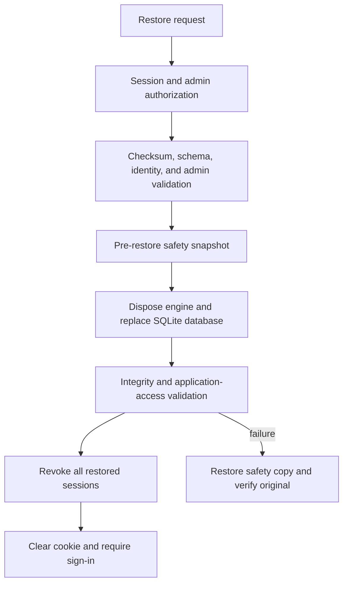

# Backup and Restore Security

This document describes the authenticated Phase 6/7 backup path for local, file-backed SQLite deployments. It is distinct from the repository's legacy shell scripts and does not claim live PostgreSQL restore support.

## Backup creation

Administrators use the canonical `/api/admin/backups` API or Backup Management page. Backup creation:

1. resolves the configured SQLite database to a canonical absolute path;
2. creates a consistent snapshot with SQLite's online backup API, including WAL state;
3. runs `PRAGMA integrity_check` and verifies required operational tables;
4. calculates SHA-256;
5. writes protected metadata containing timestamp, trigger, size, checksum, schema version, source basename, and tool version;
6. publishes the database/metadata pair atomically; and
7. applies count-based retention.

Backup directories use mode `0700`; backup, metadata, and audit files use `0600`. The directory must not be web-served or inside the frontend. Backups are not encrypted by OperatorOS, so filesystem access controls and protected storage remain operational requirements.

Retention keeps the configured number of manual backups and the latest safety snapshot. A backup selected for restore is protected from retention removal while a new safety snapshot is created.

## Restore authorization and safeguards

Restore requires all of the following:

1. `ENABLE_DESTRUCTIVE_OPERATIONS=true`;
2. a validated `astyx_session`;
3. an active database user whose role is `admin`;
4. exact typed filename confirmation;
5. filename/path validation;
6. metadata and SHA-256 validation;
7. SQLite integrity, operational-table, and schema validation;
8. compatible `users` and `sessions` tables with required columns;
9. at least one active administrator in the backup;
10. a pre-restore safety snapshot;
11. isolated replacement with rollback copy; and
12. post-replacement database and SQLAlchemy smoke validation.

Backups created before Phase 7.1 are rejected by the authenticated runtime. Legacy recovery requires a separately reviewed offline procedure; it is not silently performed by the API.

## Lifecycle

A restore is reported complete only after the restored database reopens successfully, protected table counts match, identity validation passes, and restored sessions are revoked. Post-replacement failure enters rollback and emits separate failure and rollback audit events.

## Audit lifecycle

The append-only restore audit records `restore_requested`, `restore_denied`, `restore_started`, `restore_completed`, `restore_failed`, and `restore_rolled_back`. Attribution comes only from the authenticated database user. Denial and failure reasons are controlled categories rather than raw exceptions or filesystem paths.

## Concurrency and deployment restriction

Backup and restore use a process-local operation lock. Restore and clear-data additionally share a nonblocking destructive-operation lock. Because there is no distributed or cross-process restore lock, restore fails closed when `RESTORE_SINGLE_WORKER_REQUIRED=true` and `BACKEND_WORKERS` is not `1`.

The current two-worker Docker image therefore serves normal application traffic but rejects restore. Run an explicitly controlled single-worker maintenance profile for authenticated SQLite restore. Do not claim multi-worker restore safety.

## Legacy scripts

`scripts/backup.sh` and `scripts/restore.sh`, where present, are separate operator tools with different formats and safeguards. They do not replace the authenticated API chain, identity compatibility checks, browser sign-out, or Phase 7 restore audit lifecycle. Scheduled backup operations are not part of the completed Phase 6/7 API architecture.
