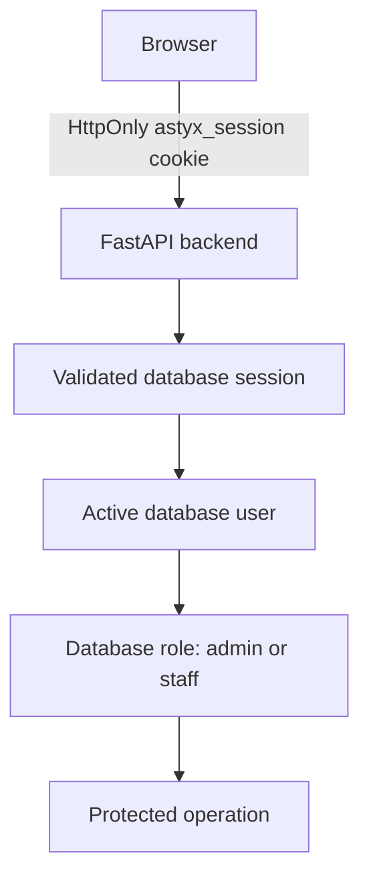

# Identity and Authentication

OperatorOS is an offline-first local application with a **Minimal Identity Boundary Layer**. It is not an IAM platform and does not implement SSO, OAuth, LDAP, cloud identity, or an external identity provider.

## Trust architecture



The backend is the authorization authority. Frontend state is used only to display identity, redirect anonymous users, and hide unavailable controls. It cannot grant access.

Trusted authorization input is the validated session and its database user role. Request fields such as `request.role`, `reviewed_by`, `entered_by`, `uploaded_by`, and similar legacy attribution strings are untrusted metadata and are never authorization inputs.

## Users and passwords

The `users` table stores username, Argon2id password hash, role, active state, login-failure state, and timestamps. Plaintext passwords are not stored or logged. The password hashing service enforces a minimum length of 12 characters when a password is hashed.

Login deliberately returns the same `Invalid username or password` response for unknown users, incorrect passwords, inactive accounts, and locked accounts. Repeated failures increment the database counter and can temporarily lock the account.

## Sessions

Authentication uses opaque server-generated tokens. The browser receives the token only as a cookie; the database stores an HMAC-SHA256 digest rather than the raw token.

Cookie contract:

| Attribute | Value |
| --- | --- |
| Name | `astyx_session` |
| HttpOnly | enabled |
| SameSite | `Lax` |
| Path | `/` |
| Secure | controlled by `COOKIE_SECURE` |

Session lifecycle:

```text
create → validate → refresh idle expiry → expire/revoke → logout
```

Sessions have idle and absolute expiration limits. Logout revokes the database session and clears the cookie. A successful database restore revokes every restored session and clears the operator cookie; reauthentication is mandatory.

No JWT, bearer-token storage, localStorage authentication, remember-me function, or frontend session-token access is implemented.

## Authorization roles

- `admin`: backup management, restore, and destructive administrative operations.
- `staff`: authenticated normal application operations; administrative backup/restore routes return `403`.

Anonymous protected requests return `401`. Client-side role guards improve navigation but do not replace backend checks.

## Audit evidence

Authentication, authorization denial, and restore lifecycle events are written to protected append-only JSONL audit files in the configured backup directory. Audit records may contain a safe session digest and request context, but never raw cookies, tokens, passwords, password hashes, or `AUTH_COOKIE_SECRET`.

## Current limitations

OperatorOS does not implement MFA, SSO, OAuth, LDAP, password-reset email, cloud identity, granular permissions, or a user-management interface.
